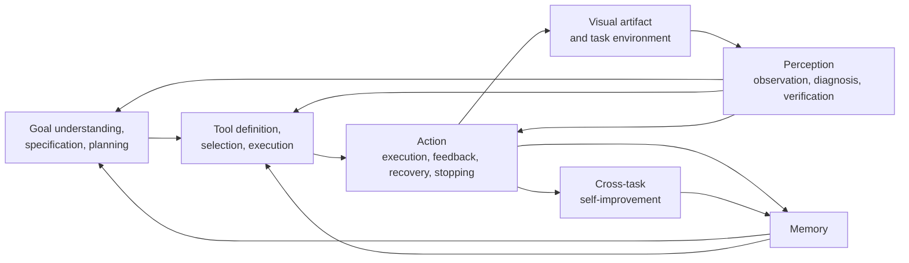

<div align="center">

# Agentic Visual Generation: A Survey

<p><strong>From single-pass rendering to observation-dependent visual creation</strong></p>

<p>
  <a href="https://ai4gc.org/">AI4GC Lab</a> ·
  <a href="https://www.zju.edu.cn/english/">Zhejiang University</a> ·
  <a href="README_zh-CN.md">中文说明</a>
</p>

<p>
  
  
  
</p>

</div>

## Overview

Visual generation is becoming a component of larger creation processes. Complex tasks require systems to preserve requirements, maintain editable state, inspect intermediate results, call tools, recover from failures, and revise later decisions.

This survey defines **Agentic Visual Generation (AVG)** as goal-driven visual creation in which runtime evidence changes subsequent creation actions. It organizes the literature with six analytical components and compares their realization across images, video and animation, 3D/CAD/worlds, scientific visualization, structured documents, UI/Web, and cross-domain multimodal systems.

> **Core criterion:** a system is agentic when an observable change in the running task, artifact, environment, or interaction history changes a later visual-creation decision.

## Six-Component Framework



The six components are an analytical decomposition. A paper may realize several components in one model, one workflow, multiple agents, or a human-agent arrangement.

## Repository Structure

| Path | Purpose |
|---|---|
| [`paper/acm-version/`](paper/acm-version/) | Original ACM manuscript source and bibliography. |
| [`paper/reading-version/`](paper/reading-version/) | Single-column reading-version source and template. |
| [`docs/writing/`](docs/writing/) | Terminology, writing standards, and manuscript structure. |
| [`docs/planning/`](docs/planning/) | Chapter plans and frontier/readability planning materials. |
| [`docs/research/`](docs/research/) | Technical-report supplement, AVG classification, and source registry. |
| [`scripts/`](scripts/) | Publicly reusable project scripts. |
| [`assets/`](assets/) | Homepage figure/logo placeholders. |
| [`literature/`](literature/) | Placeholder for the local literature archive, which is intentionally not included. |

## Survey Map

| Section | Coverage |
|---|---|
| Foundations | Definition, formalization, boundary, and L1--L5 autonomy levels. |
| Analytical components | Goal/specification/planning, memory, tools, perception, action, and cross-task self-improvement. |
| Domain systems | Image, video/animation, 3D/CAD/world, scientific visualization, documents, UI/Web, and cross-domain systems. |
| Training and improvement | Trajectory supervision, policy learning, multimodal feedback, experience reuse, and transfer. |
| Evaluation | Artifact quality, goal and constraint satisfaction, trajectory and decision quality, and system/human-centered evidence. |
| Frontiers | Expansion of visual agency, increased visual-agent intelligence, and reliable evaluation. |

## Source Packages

The ACM and reading-version sources are kept separately. The reading version is intended for browsing and discussion; the ACM version preserves the original publication-oriented template. Figure and logo files are intentionally represented by placeholders in this upload package and can be added later under `assets/` or the reading-version asset directory.

## Build

The source packages are self-contained LaTeX projects. Their original build instructions are preserved in each package README. A clean public checkout may require adding the omitted image assets before compiling the reading version.

## Citation

The author list, venue, and public paper URL are still being finalized.

```bibtex
@article{agenticvisualgeneration_survey,
  title  = {Agentic Visual Generation: A Survey},
  author = {Anonymous Author(s)},
  year   = {2026},
  note   = {Manuscript in progress}
}
```

## Status

This is an evolving survey repository. Technical-report releases, model cards, agentic systems, evaluation evidence, and frontier discussions are updated as their sources are verified.

## Acknowledgements

Prepared in the AI4GC Lab at Zhejiang University. The reading-version layout is adapted from the [HUST-ArXiv-Template](https://github.com/Shulin-Li22/HUST-ArXiv-Template).
