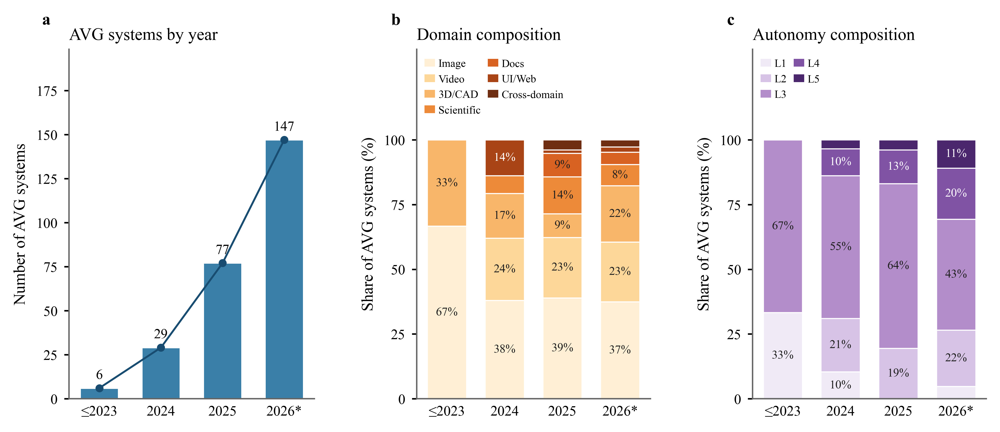

<div align="center">


# Agentic Visual Generation
## A Survey

<p><strong>From single-pass rendering to observation-dependent visual creation</strong></p>

<p>
  <a href="paper/paper.tex">Read the paper source</a>
  &nbsp;&nbsp;·&nbsp;&nbsp;
  <a href="paper/">Browse the source</a>
  &nbsp;&nbsp;·&nbsp;&nbsp;
  <a href="README_zh-CN.md">中文说明</a>
</p>

<p>
  
  
  
</p>

</div>

<p align="center">
  
</p>

<p align="center"><em>Agentic visual generation organized as a closed loop over goals, memory, tools, perception, action, and cross-task improvement.</em></p>

## At A Glance

Visual generation becomes **agentic** when runtime evidence changes a later creation action. The evidence may come from the evolving artifact, an execution environment, a verifier, or the interaction history; the action may revise a prompt, select a tool, repair a region, re-plan a workflow, or stop.

This survey builds a common vocabulary for systems that create and edit:

<table>
  <tr>
    <td align="center"><strong>Images</strong><br>generation · editing · restoration</td>
    <td align="center"><strong>Video</strong><br>storytelling · animation · editing</td>
    <td align="center"><strong>3D</strong><br>CAD · assets · worlds</td>
  </tr>
  <tr>
    <td align="center"><strong>Visual Analytics</strong><br>charts · scientific figures</td>
    <td align="center"><strong>Documents</strong><br>slides · layouts · reports</td>
    <td align="center"><strong>Interfaces</strong><br>UI · Web · interactive systems</td>
  </tr>
</table>

## Research Map

<p align="center">
  
</p>

The paper connects three views of the field:

| View | Question | Chapters |
| --- | --- | --- |
| **Operating loop** | How does a visual agent decide and act? | 1–3 |
| **Creation domains** | What kinds of artifacts can it create? | 4–10 |
| **Learning and evidence** | How does it improve, and how should it be evaluated? | 11–12 + Frontiers |

## What The Survey Adds

- **A behavioral definition:** agentic behavior is identified by an observation–action dependency.
- **A five-level autonomy scale:** L1–L5 separates fixed execution from increasingly adaptive visual creation.
- **A six-component framework:** goals and planning, memory, tools, perception, action, and cross-task self-improvement.
- **A cross-domain view:** the same control questions are compared across image, video, 3D, visualization, document, and UI/Web systems.
- **An evaluation lens:** artifact quality, goal and constraint satisfaction, trajectory and decision quality, and system or human-centered outcomes.

## Navigate The Paper

| Chapter | Focus |
| --- | --- |
| [01 · Introduction](paper/sections/01_introduction.tex) | Scope, motivation, and survey organization |
| [02 · Foundations](paper/sections/02_foundations.tex) | Visual generators, multimodality, structure, and autonomy |
| [03 · Operating Loop](paper/sections/03_operating_loop.tex) | Planning, memory, tools, perception, action, and improvement |
| [04 · Image Generation](paper/sections/04_image_generation.tex) | Image creation and editing agents |
| [05 · Video & Animation](paper/sections/05_video_animation.tex) | Long-form video, animation, and temporal control |
| [06 · 3D, CAD & Worlds](paper/sections/06_3d_cad_world.tex) | Structured assets, executable CAD, and world models |
| [07 · Scientific Visualization](paper/sections/07_scientific_visualization.tex) | Data-grounded visual analysis and figure generation |
| [08 · Structured Documents](paper/sections/08_structured_documents.tex) | Slides, documents, layouts, and rendering feedback |
| [09 · UI & Web](paper/sections/09_ui_web.tex) | Interface and webpage generation |
| [10 · Cross-Domain Systems](paper/sections/10_cross_domain.tex) | Systems that combine visual creation domains |
| [11 · Training](paper/sections/11_training.tex) | Trajectory supervision, reinforcement learning, and adaptation |
| [12 · Evaluation](paper/sections/12_evaluation.tex) | Benchmarks, protocols, reliability, safety, and human factors |
| [Frontiers](paper/sections/06_frontiers.tex) | Open questions and research directions |

## Paper Source

The [`paper/`](paper/) directory is the public, compilable manuscript source:

```text
paper/
├── paper.tex                 # Main entry point
├── sections/                 # Chapter sources
├── figures/                  # Figures used by the manuscript
├── references.bib            # Bibliography
├── hust.cls                  # Local document class
└── assets/                   # Fonts and logos
```

The repository intentionally keeps the public release focused on the paper source. Generated build artifacts and private working files are not part of the release.

## Build

From the `paper/` directory:

```bash
latexmk -xelatex -interaction=nonstopmode -halt-on-error paper.tex
```

For Overleaf, upload the contents of [`paper/`](paper/) and set `paper.tex` as the main document.

## Living Survey

The survey is maintained as a continuing research project. Updates may include:

- newly verified papers and projects;
- changes to domain coverage or taxonomy;
- revised figures, tables, and formal definitions;
- corrections to BibTeX and publication metadata;
- updates to the public project index.

Please use primary sources when proposing an update and record the affected section, source link, and change in the pull request or issue.

## Citation

The citable release record will be added after the author list, venue, and public version are finalized.

## License

Code and LaTeX source are released under the [MIT License](paper/LICENSE). Please check the source paper and its cited works for figure-specific attribution and reuse conditions.
