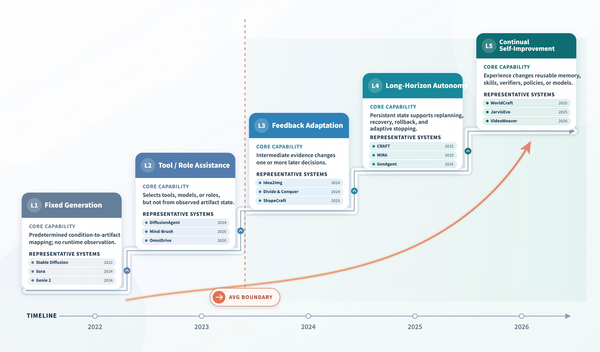

<div align="center">


# Agentic Visual Generation
## A Survey

<p><strong>从单次渲染走向依赖运行时观察的视觉创作</strong></p>

<p>
  <a href="https://www.zju.edu.cn/english/">浙江大学</a> ·
  <a href="https://ai4gc.org/">AI4GC Lab</a>
</p>

<p>
  <strong>Zihan Xing</strong><sup>1,*+</sup> ·
  <strong>Jin Wang</strong><sup>1,*</sup> ·
  <strong>Rong Xia</strong><sup>1,*</sup> ·
  <strong>Keming Ye</strong><sup>1</sup> ·
  <strong>Long Chen</strong><sup>2</sup> ·
  <strong>Zheqi Lv</strong><sup>3</sup> ·
  <strong>Shengyu Zhang</strong><sup>1,#</sup>
</p>

<p><sup>1</sup> AI4GC Lab，浙江大学 · <sup>2</sup> 香港科技大学 · <sup>3</sup> Cornell University</p>

<p>
  <a href="paper/paper.tex">阅读论文源码</a>
  &nbsp;&nbsp;·&nbsp;&nbsp;
  <a href="paper/">浏览源码</a>
  &nbsp;&nbsp;·&nbsp;&nbsp;
  <a href="README.md">English</a>
</p>

<p>
  
  
  
</p>

<p>
  <a href="https://ai4gc.org/">实验室主页</a>
  &nbsp;·&nbsp;
  <a href="https://www.zju.edu.cn/english/">学校主页</a>
  &nbsp;·&nbsp;
  <a href="https://github.com/xzhxjc/Agentic-Visual-Generation-A-Survey">项目仓库</a>
</p>

<p>
  <a href="#一眼了解">项目概览</a>
  &nbsp;·&nbsp;
  <a href="#研究地图">研究地图</a>
  &nbsp;·&nbsp;
  <a href="#论文导航">章节导航</a>
  &nbsp;·&nbsp;
  <a href="#论文源码">源码</a>
  &nbsp;·&nbsp;
  <a href="#持续更新">参与维护</a>
</p>

</div>

<p align="center">
  
</p>

<p align="center"><em>以目标、记忆、工具、感知、行动和跨任务自我改进为核心的视觉创作闭环。</em></p>

> **项目快照 · 2026 年 8 月**
>
> 一个持续更新的视觉生成综述与公开 LaTeX 仓库，关注能够规划、调用工具、检查中间结果并调整行为的视觉创作系统。

## News

| 日期 | 更新 |
| --- | --- |
| **2026-08-30** | 增加当前综述追踪的 386 条文献记录的完整可浏览索引。 |
| **2026-08-30** | 重新组织项目主页，突出分类体系、论文发现和源码导航。 |
| **持续进行** | 根据一手来源核对文献元数据、发表状态、图表和章节覆盖。 |

<p align="center">
  <a href="paper/paper.tex"></a>
  <a href="paper/sections/03_operating_loop.tex"></a>
  <a href="paper/references.bib"></a>
</p>

<details>
<summary><strong>内容速览</strong></summary>

- [项目概览](#一眼了解)
- [News](#news)
- [标签图例](#标签图例)
- [论文集合](#论文集合)
- [研究地图](#研究地图)
- [本文提供什么](#本文提供什么)
- [论文导航](#论文导航)
- [论文源码](#论文源码)
- [编译](#编译)
- [持续更新](#持续更新)

</details>

## 收录论文

当前综述追踪 **386 条 BibTeX 文献记录**，覆盖视觉创作系统的主要技术链路。完整索引按发表年份组织；只要 BibTeX 条目中包含，就会提供论文或 DOI 的直接入口。

<p align="center">
  <a href="PAPERS.md"></a>
  <a href="paper/references.bib"></a>
</p>

<table>
  <tr>
    <td><strong>基础模型</strong><br>生成模型 · 多模态 · 表示学习</td>
    <td><strong>Agentic 系统</strong><br>规划 · 工具 · 记忆 · 反思</td>
    <td><strong>视觉领域</strong><br>图像 · 视频 · 3D · 文档 · UI/Web</td>
  </tr>
  <tr>
    <td><strong>学习机制</strong><br>训练 · 适应 · 自我改进</td>
    <td><strong>评估体系</strong><br>Benchmark · 质量 · 可靠性 · 安全</td>
    <td><strong>前沿方向</strong><br>新兴系统与开放问题</td>
  </tr>
</table>

> 该索引从 [`paper/references.bib`](paper/references.bib) 生成，因此应先在 BibTeX 源文件中更新文献元数据。

## 标签图例

| 标签 | 含义 |
| --- | --- |
| `Foundation` | 生成模型、多模态、表示学习与结构化输出 |
| `Agentic` | 运行时观察会改变规划、工具调用、编辑、验证或停止行为 |
| `Domain` | 图像、视频、3D/CAD/世界、可视化、文档或 UI/Web 创作 |
| `Learning` | 训练、适应、反思、自我改进或经验复用 |
| `Evaluation` | Benchmark、质量指标、可靠性、安全性或以人为中心的评估 |

## 论文集合

下面的论文集合直接呈现综述的文献库。每条记录链接到论文或 DOI，并回链到权威 BibTeX 条目。

### 2026

- **AdaTurn: Budget-Aware Test-Time Scaling for Active Visual Perception Agents** — Liang, Susan et al. · *arXiv preprint arXiv:2607.14547* (2026) · [Paper](https://arxiv.org/abs/2607.14547) · [`liang2026adaturn`](paper/references.bib)
- **CADReasoner: Iterative Program Editing for CAD Reverse Engineering** — Kabisov, Soslan et al. · *arXiv preprint arXiv:2603.29847* (2026) · [Paper](https://arxiv.org/abs/2603.29847) · [`kabisov2026cadreasoner`](paper/references.bib)
- **CADSmith: Multi-Agent CAD Generation with Programmatic Geometric Validation** — Barkley, Jesse et al. · *arXiv preprint arXiv:2603.26512* (2026) · [Paper](https://arxiv.org/abs/2603.26512) · [`barkley2026cadsmith`](paper/references.bib)
- **CAMEO: A Conditional and Quality-Aware Multi-Agent Image Editing Orchestrator** — Pu, Yuhan et al. · *arXiv preprint arXiv:2604.03156* (2026) · [Paper](https://arxiv.org/abs/2604.03156) · [`pu2026cameo`](paper/references.bib)
- **FiRe: Fine-grained Multimodal Reasoning for Enhanced Image Generation** — Kim, Yongjin et al. · *arXiv preprint arXiv:2604.13491* (2026) · [Paper](https://arxiv.org/abs/2604.13491) · [`kim2026fire`](paper/references.bib)
- **GenAgent: Scaling Text-to-Image Generation via Agentic Multimodal Reasoning** — Jiang, Kaixun et al. · *arXiv preprint arXiv:2601.18543* (2026) · [Paper](https://arxiv.org/abs/2601.18543) · [`jiang2026genagent`](paper/references.bib)
- **GenClaw: Code-Driven Agentic Image Generation** — Ye, Junyan et al. · *arXiv preprint arXiv:2605.30248* (2026) · [Paper](https://arxiv.org/abs/2605.30248) · [`ye2026genclaw`](paper/references.bib)
- **GenEvolve: Self-Evolving Image Generation Agents via Tool-Orchestrated Visual Experience Distillation** — Chen, Sixiang et al. · *arXiv preprint arXiv:2605.21605* (2026) · [Paper](https://arxiv.org/abs/2605.21605) · [`chen2026genevolve`](paper/references.bib)
- **IterCAD: An Iterative Multimodal Agent for Visually-Grounded CAD Generation and Editing** — Hu, Tao et al. · *arXiv preprint arXiv:2606.13368* (2026) · [Paper](https://arxiv.org/abs/2606.13368) · [`hu2026itercad`](paper/references.bib)
- **Marmot: Object-Level Self-Correction via Multi-Agent Reasoning** — Sun, Jiayang et al. · *Machine Intelligence Research* (2026) · [Paper](https://arxiv.org/abs/2504.20054) · [`sun2025marmot`](paper/references.bib)
- **MetaPoint: Unlocking Precise Spatial Control in Agentic Visual Generation** — Zhou, Dewei et al. · *arXiv preprint arXiv:2606.05031* (2026) · [Paper](https://arxiv.org/abs/2606.05031) · [`zhou2026metapoint`](paper/references.bib)
- **MIRAGE: Stealthy Visual Prompt Injection for Vulnerability Detection in Web Agents** — Dai, Xuelong et al. · *arXiv preprint arXiv:2606.20717* (2026) · [Paper](https://arxiv.org/abs/2606.20717) · [`dai2026mirage`](paper/references.bib)
- **MJ1: Multimodal Judgment via Grounded Verification** — Kumar, Bhavesh et al. · *arXiv preprint arXiv:2603.07990* (2026) · [Paper](https://arxiv.org/abs/2603.07990) · [`kumar2026mj1`](paper/references.bib)
- **NEWTON: Agentic Planning for Physically Grounded Video Generation** — Feng, Yuxiang et al. · *arXiv preprint arXiv:2605.18396* (2026) · [Paper](https://arxiv.org/abs/2605.18396) · [`feng2026newton`](paper/references.bib)
- **OctoT2I: A Self-Evolving Agentic Text-to-Image Router** — Jiang, Xu et al. · *arXiv preprint arXiv:2606.01803* (2026) · [Paper](https://arxiv.org/abs/2606.01803) · [`jiang2026octot2i`](paper/references.bib)
- **OTAP: Structure-Aware Optimal Transport for Evaluating Planning and Execution in Agent Trajectories** — Barazandeh, Babak et al. · *arXiv preprint arXiv:2607.17082* (2026) · [Paper](https://arxiv.org/abs/2607.17082) · [`barazandeh2026otap`](paper/references.bib)
- **PhysAgent: Reflective Agentic Physics Control for Physically Plausible Video Generation** — Li, Qirui et al. · *arXiv preprint arXiv:2607.16355* (2026) · [Paper](https://arxiv.org/abs/2607.16355) · [`li2026physagent`](paper/references.bib)
- **PhysCodeBench: Benchmarking Physics-Aware Symbolic Simulation of 3D Scenes via Self-Corrective Multi-Agent Refinement** — Xie, Tianyidan et al. · *arXiv preprint arXiv:2604.23580* (2026) · [Paper](https://arxiv.org/abs/2604.23580) · [`xie2026physcodebench`](paper/references.bib)
- **Qwen-Image-2.0 Technical Report** — Zhao, Bing et al. · *arXiv preprint arXiv:2605.10730* (2026) · [Paper](https://arxiv.org/abs/2605.10730) · [`qwenimage2rl_2026`](paper/references.bib)
- **SciFig: Towards Automating Editable Figure Generation for Scientific Papers** — Huang, Siyuan et al. · *arXiv preprint arXiv:2601.04390* (2026) · [Paper](https://arxiv.org/abs/2601.04390) · [`huang2026scifig`](paper/references.bib)
- **StoryState: Agent-Based State Control for Consistent and Editable Storybooks** — Sarkar, Ayushman et al. · *arXiv preprint arXiv:2602.01305* (2026) · [Paper](https://arxiv.org/abs/2602.01305) · [`sarkar2026storystate`](paper/references.bib)
- **ToolArtist: Tool-Using Unified Multimodal Models for Agentic Image Generation** — Zhao, Jiahao et al. · *arXiv preprint arXiv:2608.04436* (2026) · [Paper](https://arxiv.org/abs/2608.04436) · [`zhao2026toolartist`](paper/references.bib)
- **ViMax: Agentic Video Generation** — Huang, Lingxuan et al. · *arXiv preprint arXiv:2606.07649* (2026) · [Paper](https://arxiv.org/abs/2606.07649) · [`huang2026vimax`](paper/references.bib)
- **VisualPrompter: Semantic-Aware Prompt Optimization with Visual Feedback for Text-to-Image Synthesis** — Wu, Shiyu et al. · *International Conference on Learning Representations* (2026) · [Paper](https://arxiv.org/abs/2506.23138) · [`wu2026visualprompter`](paper/references.bib)
- **3DCodeBench: Benchmarking Agentic Procedural 3D Modeling Via Code** — Yipeng Gao et al. (2026) · [Paper](https://arxiv.org/pdf/2606.01057) · [`avg260601057`](paper/references.bib)
- **A Multi-agent Framework for Democratizing XR Content Creation in K-12 Classrooms** — Yuan Chang et al. · *Communications in Computer and Information Science* (2026) · [Paper](https://doi.org/10.1007/978-3-032-30816-0_17) · [`avg260404728`](paper/references.bib)
- **A Survey: Spatiotemporal Consistency in Video Generation** — Zhiyu Yin et al. · *ACM Computing Surveys* (2026) · [Paper](https://doi.org/10.1145/3802588) · [`yin2025spatiotemporal`](paper/references.bib)
- **A Task-Driven and Quality-Assured Agent Framework for SAR Data Generation** — Xuanting Wu et al. (2026) · [Paper](https://arxiv.org/abs/2606.28896) · [`avg260628896`](paper/references.bib)
- **Action Agent: Agentic Video Generation Meets Flow-Constrained Diffusion** — Jeffrin Sam et al. (2026) · [Paper](https://arxiv.org/abs/2605.01477) · [`avg260501477`](paper/references.bib)
- **Agent Banana: High-Fidelity Image Editing with Agentic Thinking and Tooling** — Ye, Ruijie et al. · *arXiv preprint arXiv:2602.09084* (2026) · [Paper](https://arxiv.org/abs/2602.09084) · [`ye2026agentbanana`](paper/references.bib)
- **Agent-Aided Design for Dynamic CAD Models** — Mitch Adler et al. · *Proceedings of the ACM Conference on AI and Agentic Systems* (2026) · [Paper](https://doi.org/10.1145/3786335.3813198) · [`avg260415184`](paper/references.bib)
- **Agentic AI for Personalized Physiotherapy: A Multi-Agent Framework for Generative Video Training and Real-Time Pose Correction** — Abhishek Dharmaratnakar et al. · *2026 IEEE International Conference on Digital Health (ICDH)* (2026) · [Paper](https://doi.org/10.1109/icdh72779.2026.00059) · [`avg260421154`](paper/references.bib)
- **Agentic Designer: Progressive Multi-Agent Collaboration for Structure-Aware Interior Layout Generation** — Zhijing Yang et al. · *IEEE Transactions on Pattern Analysis and Machine Intelligence* (2026) · [Paper](https://doi.org/10.1109/tpami.2026.3711762) · [`avg260720866`](paper/references.bib)
- **Agentic Flow Steering and Parallel Rollout Search for Spatially Grounded Text-to-Image Generation** — Ping Chen et al. (2026) · [Paper](https://arxiv.org/abs/2603.18627) · [`avg260318627`](paper/references.bib)
- **Agentic Retoucher for Text-To-Image Generation** — Shaocheng Shen et al. (2026) · [Paper](https://arxiv.org/abs/2601.02046) · [`avg260102046`](paper/references.bib)
- **AGILE: Hand-object Interaction Reconstruction from Video via Agentic Generation** — Jin-Chuan Shi et al. · *Proceedings of the Special Interest Group on Computer Graphics and Interactive Techniques Conference Conference Papers* (2026) · [Paper](https://doi.org/10.1145/3799902.3811134) · [`avg260204672`](paper/references.bib)
- **AI-Gram: When Visual Agents Interact in a Social Network** — Andrew Shin (2026) · [Paper](https://arxiv.org/abs/2604.21446) · [`avg260421446`](paper/references.bib)
- **AnimeAgent: Is the Multi-Agent via Image-to-Video models a Good Disney Storytelling Artist?** — Hailong Yan et al. (2026) · [Paper](https://arxiv.org/abs/2602.20664) · [`avg260220664`](paper/references.bib)
- **APE: Agentic Prompt Enhancer for Image Generation and Editing** — Zijian Huang et al. (2026) · [Paper](https://arxiv.org/abs/2606.00204) · [`avg260600204`](paper/references.bib)
- **ArtiCAD: Articulated CAD Assembly Design via Multi-Agent Code Generation** — Yuan Shui et al. (2026) · [Paper](https://arxiv.org/abs/2604.10992) · [`avg260410992`](paper/references.bib)
- **Articraft: An Agentic System for Scalable Articulated 3D Asset Generation** — Matt Zhou et al. (2026) · [Paper](https://arxiv.org/pdf/2605.15187) · [`avg260515187`](paper/references.bib)
- **ATP-Bench: Towards Agentic Tool Planning for MLLM Interleaved Generation** — Yinuo Liu et al. (2026) · [Paper](https://arxiv.org/abs/2603.29902) · [`avg260329902`](paper/references.bib)
- **Aurora: Unified Video Editing with a Tool-Using Agent** — Yongsheng Yu et al. (2026) · [Paper](https://arxiv.org/pdf/2605.18748) · [`avg260518748`](paper/references.bib)
- **Authoring for Living Worlds: Tool-Constrained LLM Agents for Executable Multi-Actor Scenarios** — Nicolae Cudlenco et al. (2026) · [Paper](https://arxiv.org/abs/2604.10383) · [`avg260410383`](paper/references.bib)
- **Autonomous Video Generation with Counterfactual Controllability for Self-Evolving World Models** — Xin Wang et al. (2026) · [Paper](https://arxiv.org/abs/2606.24152) · [`avg260624152`](paper/references.bib)
- **Beyond End-to-End Video Models: An LLM-Based Multi-Agent System for Educational Video Generation** — Lingyong Yan et al. · *Proceedings of the 32nd ACM SIGKDD Conference on Knowledge Discovery and Data Mining V.2* (2026) · [Paper](https://doi.org/10.1145/3770855.3818323) · [`avg260211790`](paper/references.bib)
- **Boogu-Image-0.1: Boosting Open Agentic Multimodal Generation via Understanding under a Minimal Budget** — Guoxuan Chen et al. (2026) · [Paper](https://arxiv.org/abs/2607.13125) · [`avg260713125`](paper/references.bib)
- **BrandFusion: A Multi-Agent Framework for Seamless Brand Integration in Text-to-Video Generation** — Zihao Zhu et al. (2026) · [Paper](https://arxiv.org/abs/2603.02816) · [`avg260302816`](paper/references.bib)
- **Bridging Creative Intent and Visual Quality: Creator-Driven Recurrent Video Generation with Agentic Feedback Loops** — Denis Savytski et al. (2026) · [Paper](https://arxiv.org/abs/2606.18591) · [`avg260618591`](paper/references.bib)
- **CAD-Judge: Toward Efficient Morphological Grading and Verification for Text-to-CAD Generation** — Zheyuan Zhou et al. · *ICASSP 2026 - 2026 IEEE International Conference on Acoustics, Speech and Signal Processing (ICASSP)* (2026) · [Paper](https://doi.org/10.1109/icassp55912.2026.11461978) · [`zhou2025cadjudge`](paper/references.bib)
- **Camera Artist: A Multi-Agent Framework for Cinematic Language Storytelling Video Generation** — Haobo Hu et al. (2026) · [Paper](https://arxiv.org/abs/2604.09195) · [`avg260409195`](paper/references.bib)
- **CanvasAgent: Enabling Complex Image Creation and Editing via Visual Tool Orchestration** — Hairui Zhu et al. (2026) · [Paper](https://arxiv.org/abs/2607.05465) · [`avg260705465`](paper/references.bib)
- **CineAGI: Character-Consistent Movie Creation through LLM-Orchestrated Multi-Modal Generation and Cross-Scene Integration** — Tianyidan Xie et al. (2026) · [Paper](https://arxiv.org/abs/2604.23579) · [`avg260423579`](paper/references.bib)
- **Clarify Before Executing: A Self-Evolving Agent for Resolving Intent Asymmetry in 3D Tool Orchestration** — Xiaoye Zhu et al. (2026) · [Paper](https://arxiv.org/abs/2607.16352) · [`avg260716352`](paper/references.bib)
- **Clarify Before You Draw: Proactive Agents for Robust Text-to-CAD Generation** — Bo Yuan et al. (2026) · [Paper](https://arxiv.org/abs/2602.03045) · [`avg260203045`](paper/references.bib)
- **Closed-Loop Triplet Synergistic Generation for Long-Form Video** — Xinlei Yin et al. (2026) · [Paper](https://arxiv.org/abs/2606.16184) · [`avg260616184`](paper/references.bib)
- **Co-Director: Agentic Generative Video Storytelling** — Yale Song et al. (2026) · [Paper](https://arxiv.org/abs/2604.24842) · [`avg260424842`](paper/references.bib)
- **Code2UML: Agentic LLMs with context engineering for scalable software visualization** — Alin-Gabriel V{\ua}duva et al. (2026) · [Paper](https://arxiv.org/pdf/2605.24453) · [`avg260524453`](paper/references.bib)
- **coDrawAgents: A Multi-Agent Dialogue Framework for Compositional Image Generation** — Chunhan Li et al. (2026) · [Paper](https://arxiv.org/abs/2603.12829) · [`avg260312829`](paper/references.bib)
- **CoGen3D: An Agentic Human-AI Co-Design Pipeline for 3D Asset Generation for Virtual Reality** — Weiwei Jiang et al. (2026) · [Paper](https://arxiv.org/abs/2607.03731) · [`avg260703731`](paper/references.bib)
- **Cognitive-structured Multimodal Agent for Multimodal Understanding, Generation, and Editing** — Feng Wang et al. (2026) · [Paper](https://arxiv.org/abs/2607.08497) · [`avg260708497`](paper/references.bib)
- **COMFYCLAW: Self-Evolving Skill Harnesses for Image Generation Workflows** — Zongxia Li et al. (2026) · [Paper](https://arxiv.org/abs/2607.01709) · [`avg260701709`](paper/references.bib)
- **Crafter: A Multi-Agent Harness for Editable Scientific Figure Generation from Diverse Inputs** — Haozhe Zhao et al. (2026) · [Paper](https://arxiv.org/pdf/2605.30611) · [`avg260530611`](paper/references.bib)
- **Crayotter: Traceable Multi-Agent Workflows for Long-Form Video Editing** — Lecheng Yan et al. (2026) · [Paper](https://arxiv.org/pdf/2606.07636) · [`avg260607636`](paper/references.bib)
- **CutClaw: Agentic Hours-Long Video Editing via Music Synchronization** — Shifang Zhao et al. (2026) · [Paper](https://arxiv.org/pdf/2603.29664) · [`avg260329664`](paper/references.bib)
- **Cutscene Agent: An LLM Agent Framework for Automated 3D Cutscene Generation** — Lanshan He et al. (2026) · [Paper](https://arxiv.org/abs/2604.25318) · [`avg260425318`](paper/references.bib)
- **DataEvolver: Self-Evolving Multi-Agent Data Construction for Text-Rich Image Generation** — Siyu Yan et al. (2026) · [Paper](https://arxiv.org/abs/2606.31537) · [`avg260631537`](paper/references.bib)
- **DATAREEL: Automated Data-Driven Video Story Generation with Animations** — Ridwan Mahbub et al. (2026) · [Paper](https://arxiv.org/abs/2604.25220) · [`avg260425220`](paper/references.bib)
- **DeepPresenter: Environment-Grounded Reflection for Agentic Presentation Generation** — Hao Zheng et al. · *Findings of the Association for Computational Linguistics: ACL 2026* (2026) · [Paper](https://doi.org/10.18653/v1/2026.findings-acl.1578) · [`zheng2026deeppresenter`](paper/references.bib)
- **Derain-Agent: A Plug-and-Play Agent Framework for Rainy Image Restoration** — Zhaocheng Yu et al. (2026) · [Paper](https://arxiv.org/pdf/2603.11866) · [`avg260311866`](paper/references.bib)
- **DiffGraph: An Automated Agent-driven Model Merging Framework for In-the-Wild Text-to-Image Generation** — Zhuoling Li et al. (2026) · [Paper](https://arxiv.org/pdf/2603.20470) · [`avg260320470`](paper/references.bib)
- **DIRECT: Video Mashup Creation via Hierarchical Multi-Agent Planning and Intent-Guided Editing** — Ke Li et al. (2026) · [Paper](https://arxiv.org/pdf/2604.04875) · [`avg260404875`](paper/references.bib)
- **DirectorBench: Diagnosing Long-Form Video Generation with Personalized Multi-Agent Evaluation** — Jiamin Chen et al. (2026) · [Paper](https://arxiv.org/abs/2605.30090) · [`avg260530090`](paper/references.bib)
- **DiTTo: Scalable Order-aware All-in-One Image Restoration Agent** — Seungho Choi et al. (2026) · [Paper](https://arxiv.org/pdf/2605.30915) · [`avg260530915`](paper/references.bib)
- **Does AI Understand Imaging? A Systematic Benchmark of Agentic AI for Computational Imaging Tasks** — Ethan Chung et al. (2026) · [Paper](https://arxiv.org/abs/2607.07189) · [`avg260707189`](paper/references.bib)
- **EditRefiner: A Human-Aligned Agentic Framework for Image Editing Refinement** — Zitong Xu et al. (2026) · [Paper](https://arxiv.org/pdf/2605.07457) · [`avg260507457`](paper/references.bib)
- **ETPDesigner: Multi-Agent Orchestration for Interactive Multimodal Electronic Theater Program** — Mengtian Li et al. (2026) · [Paper](https://arxiv.org/abs/2607.19947) · [`avg260719947`](paper/references.bib)
- **EvoIR-Agent: Self-Evolving Image Restoration Agentic System via Experience-Driven Learning** — Kailin Zhuang et al. (2026) · [Paper](https://arxiv.org/pdf/2605.22208v1) · [`avg260522208`](paper/references.bib)
- **Exploring Agentic Workflows for Generating High Quality Math Visual Aids** — Rizwaan Malik et al. (2026) · [Paper](https://arxiv.org/abs/2607.09839) · [`avg260709839`](paper/references.bib)
- **Exploring LLM Agent Designs and Interaction Modalities for Scientific Visualization** — Jackson Vonderhorst et al. (2026) · [Paper](https://arxiv.org/pdf/2604.27996) · [`avg260427996`](paper/references.bib)
- **FantasyHSI: Video-Generation-Centric 4D Human Synthesis in Any Scene Through a Graph-Based Multi-Agent Framework** — Lingzhou Mu et al. · *Proceedings of the AAAI Conference on Artificial Intelligence* (2026) · [Paper](https://doi.org/10.1609/aaai.v40i10.37758) · [`avg250901232`](paper/references.bib)
- **Feynman: Knowledge-Infused Diagramming Agent for Scalable Visual Designs** — Zixin Wen et al. (2026) · [Paper](https://arxiv.org/pdf/2603.12597) · [`avg260312597`](paper/references.bib)
- **FilmWorld: Agentic Novel-to-Film Generation through Dynamic Cinematic World Modeling** — Jialong Zuo et al. (2026) · [Paper](https://arxiv.org/abs/2607.19038) · [`avg260719038`](paper/references.bib)
- **From Plans to Pixels: Learning to Plan and Orchestrate for Open-Ended Image Editing** — Anirudh Sundara Rajan et al. (2026) · [Paper](https://arxiv.org/pdf/2605.15181) · [`avg260515181`](paper/references.bib)
- **GA-VisAgent: A Multi-agent Application for Code Generation and Visualization in Interactive Learning** — Jian Wang et al. · *Lecture Notes in Computer Science* (2026) · [Paper](https://doi.org/10.1007/978-3-032-22539-9_6) · [`avg260501299`](paper/references.bib)
- **GameDevBench: Evaluating Agentic Capabilities Through Game Development** — Wayne Chi et al. (2026) · [Paper](https://arxiv.org/abs/2602.11103) · [`avg260211103`](paper/references.bib)
- **GameUIAgent: An LLM-Powered Framework for Automated Game UI Design with Structured Intermediate Representation** — Wei Zeng et al. (2026) · [Paper](https://arxiv.org/abs/2603.14724) · [`avg260314724`](paper/references.bib)
- **Gen-Searcher: Reinforcing Agentic Search for Image Generation** — Kaituo Feng et al. (2026) · [Paper](https://arxiv.org/abs/2603.28767) · [`avg260328767`](paper/references.bib)
- **Generation Navigator: A State-Aware Agentic Framework for Image Generation** — Jinming Liu et al. (2026) · [Paper](https://arxiv.org/abs/2605.17969) · [`avg260517969`](paper/references.bib)
- **Genflow Ad Studio: A Compound AI Architecture for Brand-Aligned, Self-Correcting Video Generation** — Debanshu Das et al. · *Proceedings of the ACM Conference on AI and Agentic Systems* (2026) · [Paper](https://doi.org/10.1145/3786335.3813213) · [`avg260516748`](paper/references.bib)
- **GENMAC: Compositional Text-to-Video Generation with Multi-Agent Collaboration** — Kaiyi Huang et al. · *Proceedings of the AAAI Conference on Artificial Intelligence* (2026) · [Paper](https://doi.org/10.1609/aaai.v40i7.37418) · [`huang2024genmac`](paper/references.bib)
- **GLANCE: A Global-Local Coordination Multi-Agent Framework for Music-Grounded Non-Linear Video Editing** — Zihao Lin et al. (2026) · [Paper](https://arxiv.org/pdf/2604.05076) · [`avg260405076`](paper/references.bib)
- **HiLSVA: Design and Evaluation of a Human-in-the-Loop Agentic System for Scientific Visualization** — Kuangshi Ai et al. (2026) · [Paper](https://arxiv.org/abs/2606.26614) · [`avg260626614`](paper/references.bib)
- **I2E: From Image Pixels to Actionable Interactive Environments for Text-Guided Image Editing** — Jinghan Yu et al. · *Proceedings of the 64th Annual Meeting of the Association for Computational Linguistics (Volume 1: Long Papers)* (2026) · [Paper](https://doi.org/10.18653/v1/2026.acl-long.2076) · [`avg260103741`](paper/references.bib)
- **IEA: Amateur-Friendly Conversational Image Editing Agent via Three Stages of Multitask Alignment** — Zichen Zhu et al. (2026) · [Paper](https://arxiv.org/pdf/2606.08016) · [`avg260608016`](paper/references.bib)
- **IMAGAgent: Orchestrating Multi-Turn Image Editing via Constraint-Aware Planning and Reflection** — Fei Shen et al. (2026) · [Paper](https://arxiv.org/pdf/2603.29602) · [`avg260329602`](paper/references.bib)
- **ImageEdit-R1: Boosting Multi-Agent Image Editing via Reinforcement Learning** — Yiran Zhao et al. (2026) · [Paper](https://arxiv.org/pdf/2603.08059) · [`avg260308059`](paper/references.bib)
- **InterleaveThinker: Reinforcing Agentic Interleaved Generation** — Dian Zheng et al. (2026) · [Paper](https://arxiv.org/abs/2606.13679) · [`avg260613679`](paper/references.bib)
- **Iterative Refinement Improves Compositional Image Generation** — Jaiswal, Shantanu et al. · *arXiv preprint arXiv:2601.15286* (2026) · [Paper](https://arxiv.org/abs/2601.15286) · [`jaiswal2026iterative`](paper/references.bib)
- **JAVEDIT: Joint Audio-Visual Instruction-Guided Video Editing with Agentic Data Curation** — Yinan Chen et al. (2026) · [Paper](https://arxiv.org/pdf/2606.03168) · [`avg260603168`](paper/references.bib)
- **Lighting-grounded Video Generation with Renderer-based Agent Reasoning** — Ziqi Cai et al. (2026) · [Paper](https://arxiv.org/pdf/2604.07966) · [`avg260407966`](paper/references.bib)
- **LogiStory: A Logic-Aware Framework for Multi-Image Story Visualization** — Chutian Meng et al. (2026) · [Paper](https://arxiv.org/abs/2603.28082) · [`avg260328082`](paper/references.bib)
- **M3: High-fidelity Text-to-Image Generation via Multi-Modal, Multi-Agent and Multi-Round Visual Reasoning** — Bangji Yang et al. (2026) · [Paper](https://arxiv.org/abs/2602.06166) · [`avg260206166`](paper/references.bib)
- **MA3DSG: Multi-Agent 3D Scene Graph Generation for Large-Scale Indoor Environments** — Yirum Kim et al. (2026) · [Paper](https://arxiv.org/abs/2602.04152) · [`avg260204152`](paper/references.bib)
- **Making Image Editing Easier via Adaptive Task Reformulation with Agentic Executions** — Bo Zhao et al. (2026) · [Paper](https://arxiv.org/pdf/2604.15917) · [`avg260415917`](paper/references.bib)
- **MAVIN: Multi-Shot Audio-Visual Generation with Customized Narrative Control** — Kaiqi Liu et al. (2026) · [Paper](https://arxiv.org/abs/2606.29473) · [`avg260629473`](paper/references.bib)
- **MAViS: A Multi-Agent Framework for Long-Sequence Video Storytelling** — Qian Wang et al. · *Proceedings of the 19th Conference of the European Chapter of the Association for Computational Linguistics (Volume 1: Long Papers)* (2026) · [Paper](https://doi.org/10.18653/v1/2026.eacl-long.101) · [`avg250808487`](paper/references.bib)
- **MetaWorld: Scaling Multi-Agent Video World Model from Single-view Video Data** — Teng Hu et al. (2026) · [Paper](https://arxiv.org/pdf/2606.02753) · [`avg260602753`](paper/references.bib)
- **Metric-Guided Synthetic Image Data Rendering for Deep Learning compatible with Agentic AI** — Martina Radoynova et al. (2026) · [Paper](https://arxiv.org/abs/2607.12874) · [`avg260712874`](paper/references.bib)
- **Mind-Brush: Integrating Agentic Cognitive Search and Reasoning into Image Generation** — Jun He et al. (2026) · [Paper](https://arxiv.org/abs/2602.01756) · [`avg260201756`](paper/references.bib)
- **Mind-of-Director: Multi-modal Agent-Driven Film Previsualization via Collaborative Decision-Making** — Shufeng Nan et al. (2026) · [Paper](https://arxiv.org/abs/2603.14790) · [`avg260314790`](paper/references.bib)
- **MM-WebAgent: A Hierarchical Multimodal Web Agent for Webpage Generation** — Yan Li et al. (2026) · [Paper](https://arxiv.org/abs/2604.15309) · [`avg260415309`](paper/references.bib)
- **MSRAMIE: Multimodal Structured Reasoning Agent for Multi-instruction Image Editing** — Zhaoyuan Qiu et al. (2026) · [Paper](https://arxiv.org/pdf/2603.16967) · [`avg260316967`](paper/references.bib)
- **Multi-Agent Image Restoration** — Xu Jiang et al. · *International Journal of Computer Vision* (2026) · [Paper](https://doi.org/10.1007/s11263-026-02792-5) · [`avg250309403`](paper/references.bib)
- **MultiVis-Agent: A Multi-Agent Framework with Logic Rules for Reliable and Comprehensive Cross-Modal Data Visualization** — Jinwei Lu et al. · *Proceedings of the ACM on Management of Data* (2026) · [Paper](https://doi.org/10.1145/3786670) · [`avg260118320`](paper/references.bib)
- **MultiWorld: Scalable Multi-Agent Multi-View Video World Models** — Haoyu Wu et al. (2026) · [Paper](https://arxiv.org/abs/2604.18564) · [`avg260418564`](paper/references.bib)
- **MuMA: 3D PBR Texturing via Multi-Channel Multi-View Generation and Albedo Post-Processing** — Lingting Zhu et al. · *IEEE Transactions on Image Processing* (2026) · [Paper](https://doi.org/10.1109/TIP.2026.3684391) · [`avg250318461`](paper/references.bib)
- **MUSE: A Multi-agent Framework for Unconstrained Story Envisioning via Closed-Loop Cognitive Orchestration** — Wenzhang Sun et al. (2026) · [Paper](https://arxiv.org/abs/2602.03028) · [`avg260203028`](paper/references.bib)
- **NaLA: A 3D Native LLM Layout Agent for High-quality 3D Scene Generation** — Cheng Wan et al. (2026) · [Paper](https://arxiv.org/abs/2606.29395) · [`avg260629395`](paper/references.bib)
- **New Agents, Mobile Apps and Gemini Omni for Google Flow and Flow Music** — Roman, Elias (2026) · [Paper](https://blog.google/innovation-and-ai/models-and-research/google-labs/flow-updates/) · [`roman2026flowagents`](paper/references.bib)
- **NOMAD: A Multi-Agent LLM System for UML Class Diagram Generation from Natural Language Requirements** — Polydoros Giannouris et al. · *Proceedings of the 14th International Conference on Model-Based Software and Systems Engineering* (2026) · [Paper](https://doi.org/10.5220/0014301900004058) · [`avg251122409`](paper/references.bib)
- **OmniDrive: An LLM-Choreographed Multi-Agent World Model with Unified Latent Co-Compression for Multi-View Driving Video Generation** — Zijie Meng et al. (2026) · [Paper](https://arxiv.org/abs/2606.17536) · [`avg260617536`](paper/references.bib)
- **One Image is All You Need: Agentic One-Shot Image Generation via Text-Based World Models for Long-Tail Spatial Perception** — Keqin Zeng et al. (2026) · [Paper](https://arxiv.org/abs/2606.20764) · [`avg260620764`](paper/references.bib)
- **One Sentence, One Drama: Personalized Short-Form Drama Generation via Multi-Agent Systems** — Yufei Shi et al. (2026) · [Paper](https://arxiv.org/abs/2605.22144) · [`avg260522144`](paper/references.bib)
- **OPERA: An Agent for Image Restoration with End-to-End Joint Planning-Execution Optimization** — Feng Zhu et al. (2026) · [Paper](https://arxiv.org/pdf/2605.22104) · [`avg260522104`](paper/references.bib)
- **OrchestrXR: A Multi-Agent System for Idea-to-Prototype XR Study Authoring** — Shuqi Liao et al. (2026) · [Paper](https://arxiv.org/abs/2607.01588) · [`avg260701588`](paper/references.bib)
- **OrchJail: Jailbreaking Tool-Calling Text-to-Image Agents by Orchestration-Guided Fuzzing** — Jianming Chen et al. · *Proceedings of the 43rd International Conference on Machine Learning* (2026) · [Paper](https://arxiv.org/abs/2605.07414) · [`avg260507414`](paper/references.bib)
- **PaAgent: Portrait-Aware Image Restoration Agent via Subjective-Objective Reinforcement Learning** — Yijian Wang et al. (2026) · [Paper](https://arxiv.org/pdf/2603.17055) · [`avg260317055`](paper/references.bib)
- **Perceptual Self-Reflection in Agentic Physics Simulation Code Generation** — Prashant Shende et al. (2026) · [Paper](https://arxiv.org/abs/2602.12311) · [`avg260212311`](paper/references.bib)
- **Physics-in-the-Loop: A Hybrid Agentic Architecture for Validated CAD Engineering Design** — Elias Berger et al. (2026) · [Paper](https://arxiv.org/abs/2605.19717) · [`avg260519717`](paper/references.bib)
- **PlayCoder: Making LLM-Generated GUI Code Playable** — Zhiyuan Peng et al. · *Proceedings of the ACM on Software Engineering* (2026) · [Paper](https://doi.org/10.1145/3808097) · [`avg260419742`](paper/references.bib)
- **Prisma-World: Camera-Controllable Multi-Agent Video World Model** — Huiqiang Sun et al. (2026) · [Paper](https://arxiv.org/pdf/2606.09507) · [`avg260609507`](paper/references.bib)
- **Qwen-Image-Agent: Bridging the Context Gap in Real-World Image Generation** — Zekai Zhang et al. (2026) · [Paper](https://arxiv.org/abs/2606.26907) · [`avg260626907`](paper/references.bib)
- **RedEdit: Agentic Red-Teaming of Image Safety Classifiers via MCTS-Guided Photo-Editing** — Weilin Lin et al. (2026) · [Paper](https://arxiv.org/pdf/2606.06140) · [`avg260606140`](paper/references.bib)
- **RS-Gen: A Multi-Stage Agentic Framework for Reasoning and Search-Augmented Image Generation** — Feifei Bian et al. (2026) · [Paper](https://arxiv.org/abs/2606.23221) · [`avg260623221`](paper/references.bib)
- **SAGE: Structured Agentic Graph Editing for Software Diagrams** — Tyler Sivertsen et al. (2026) · [Paper](https://arxiv.org/abs/2607.01102) · [`avg260701102`](paper/references.bib)
- **SASAV: Self-Directed Agent for Scientific Analysis and Visualization** — Jianxin Sun et al. (2026) · [Paper](https://arxiv.org/pdf/2604.03406) · [`avg260403406`](paper/references.bib)
- **ScaleEdit-12M: Scaling Open-Source Image Editing Data Generation via Multi-Agent Framework** — Guanzhou Chen et al. (2026) · [Paper](https://arxiv.org/pdf/2603.20644) · [`avg260320644`](paper/references.bib)
- **SceneConductor: 3D Scene Generation from a Single Image with Multi-Agent Orchestration** — Jeonghwan Kim et al. (2026) · [Paper](https://arxiv.org/abs/2606.08402) · [`avg260608402`](paper/references.bib)
- **SciFlow-Bench: Evaluating Structure-Aware Scientific Diagram Generation via Inverse Parsing** — Tong Zhang et al. · *Proceedings of the 64th Annual Meeting of the Association for Computational Linguistics (Volume 1: Long Papers)* (2026) · [Paper](https://doi.org/10.18653/v1/2026.acl-long.807) · [`avg260209809`](paper/references.bib)
- **SciVisAgentBench: A Benchmark for Evaluating Scientific Data Analysis and Visualization Agents** — Kuangshi Ai et al. (2026) · [Paper](https://arxiv.org/pdf/2603.29139) · [`avg260329139`](paper/references.bib)
- **SciVisAgentSkills: Design and Evaluation of Agent Skills for Scientific Data Analysis and Visualization** — Kuangshi Ai et al. (2026) · [Paper](https://arxiv.org/pdf/2606.05525) · [`avg260605525`](paper/references.bib)
- **SCMAPR: Self-Correcting Multi-Agent Prompt Refinement for Complex-Scenario Text-to-Video Generation** — Chengyi Yang et al. · *Findings of the Association for Computational Linguistics: ACL 2026* (2026) · [Paper](https://doi.org/10.18653/v1/2026.findings-acl.345) · [`avg260405489`](paper/references.bib)
- **Search Beyond What Can Be Taught: Evolving the Knowledge Boundary in Agentic Visual Generation** — Wang, Haozhe et al. · *arXiv preprint arXiv:2607.05382* (2026) · [Paper](https://arxiv.org/abs/2607.05382) · [`wang2026searchgen`](paper/references.bib)
- **See Before You Code: Learning Visual Priors for Spatially Aware Educational Animation Generation** — Yuejia Li et al. (2026) · [Paper](https://arxiv.org/abs/2605.15585) · [`avg260515585`](paper/references.bib)
- **Self-Evolving Agentic Image Restoration via Deliberate Planning and Intuitive Execution** — Shuang Cui et al. (2026) · [Paper](https://arxiv.org/abs/2606.28971) · [`avg260628971`](paper/references.bib)
- **Self-Reasoning Agentic Framework for Narrative Product Grid-Collage Generation** — Minyan Luo et al. (2026) · [Paper](https://arxiv.org/abs/2604.16958) · [`avg260416958`](paper/references.bib)
- **ShareVerse: Multi-Agent Consistent Video Generation for Shared World Modeling** — Jiayi Zhu et al. (2026) · [Paper](https://arxiv.org/abs/2603.02697) · [`avg260302697`](paper/references.bib)
- **SIDiffAgent: Self-Improving Diffusion Agent** — Shivank Garg et al. (2026) · [Paper](https://arxiv.org/abs/2602.02051) · [`avg260202051`](paper/references.bib)
- **Sima 1.0: A Collaborative Multi-Agent Framework for Documentary Video Production** — Zhao Song (2026) · [Paper](https://arxiv.org/abs/2604.07721) · [`avg260407721`](paper/references.bib)
- **SimWorlds: A Multi-Agent System for Dynamic 3D Scene Creation** — Chunjiang Liu et al. (2026) · [Paper](https://arxiv.org/abs/2607.01766) · [`avg260701766`](paper/references.bib)
- **Soap2Soap: Long Cinematic Video Remaking via Multi-Agent Collaboration** — Yiren Song et al. (2026) · [Paper](https://arxiv.org/abs/2605.17423) · [`avg260517423`](paper/references.bib)
- **Socratic-Geo: Synthetic Data Generation and Geometric Reasoning via Multi-Agent Interaction** — Zhengbo Jiao et al. (2026) · [Paper](https://arxiv.org/abs/2602.03414) · [`avg260203414`](paper/references.bib)
- **Sol Video Inference Engine: Agent-Native Full-Stack Acceleration Framework for Efficient Video Generation** — Yitong Li et al. (2026) · [Paper](https://arxiv.org/abs/2606.23743) · [`avg260623743`](paper/references.bib)
- **Streaming Multi-Agent Autoregressive Diffusion Model with World State Registers** — Sicheng Mo et al. (2026) · [Paper](https://arxiv.org/abs/2607.21594) · [`avg260721594`](paper/references.bib)
- **Talk2Image: A Multi-Agent System for Multi-Turn Image Generation and Editing** — Shichao Ma et al. · *Proceedings of the AAAI Conference on Artificial Intelligence* (2026) · [Paper](https://doi.org/10.1609/aaai.v40i38.40519) · [`avg250806916`](paper/references.bib)
- **Taming I2V models for Image HOI Editing: A Cognitive Benchmark and Agentic Self-Correcting Framework** — Jiayi Gao et al. (2026) · [Paper](https://arxiv.org/pdf/2606.19073) · [`avg260619073`](paper/references.bib)
- **The Script is All You Need: An Agentic Framework for Long-Horizon Dialogue-to-Cinematic Video Generation** — Chenyu Mu et al. (2026) · [Paper](https://arxiv.org/abs/2601.17737) · [`avg260117737`](paper/references.bib)
- **TIR-Agent: Training an Explorative and Efficient Agent for Image Restoration** — Guoli Jia et al. (2026) · [Paper](https://arxiv.org/pdf/2603.27742) · [`avg260327742`](paper/references.bib)
- **TOOLCAD: Exploring Tool-Using Large Language Models in Text-to-CAD Generation with Reinforcement Learning** — Yifei Gong et al. · *Findings of the Association for Computational Linguistics: ACL 2026* (2026) · [Paper](https://doi.org/10.18653/v1/2026.findings-acl.1160) · [`gong2026toolcad`](paper/references.bib)
- **Toward AI VIS Co-Scientists: A General and End-to-End Agent Harness for Solving Complex Data Visualization Tasks** — Haichao Miao et al. (2026) · [Paper](https://arxiv.org/pdf/2605.21825) · [`avg260521825`](paper/references.bib)
- **Towards Reliable Agentic Progressive Text-to-Visualization with Verification Rules** — Wenxin Xu et al. (2026) · [Paper](https://arxiv.org/pdf/2605.29692) · [`avg260529692`](paper/references.bib)
- **Towards Verifiable Multimodal Deep Research: A Multi-Agent Harness for Interleaved Report Generation** — Chenghao Zhang et al. (2026) · [Paper](https://arxiv.org/pdf/2605.29861) · [`avg260529861`](paper/references.bib)
- **Training and Agentic Inference Strategies for LLM-based Manim Animation Generation** — Ravidu Suien Rammuni Silva et al. (2026) · [Paper](https://arxiv.org/abs/2604.18364) · [`avg260418364`](paper/references.bib)
- **TVIR: Building Deep Research Agents Towards Text-Visual Interleaved Report Generation** — Xinkai Ma et al. (2026) · [Paper](https://arxiv.org/abs/2606.02320) · [`avg260602320`](paper/references.bib)
- **Unify-Agent: A Unified Multimodal Agent for World-Grounded Image Synthesis** — Shawn Chen et al. (2026) · [Paper](https://arxiv.org/pdf/2603.29620) · [`avg260329620`](paper/references.bib)
- **UniReason 1.0: A Unified Reasoning Framework for World Knowledge Aligned Image Generation and Editing** — Dianyi Wang et al. (2026) · [Paper](https://arxiv.org/abs/2602.02437) · [`avg260202437`](paper/references.bib)
- **Value-Aligned Prompt Moderation via Zero-Shot Agentic Rewriting for Safe Image Generation** — Xin Zhao et al. · *Proceedings of the AAAI Conference on Artificial Intelligence* (2026) · [Paper](https://doi.org/10.1609/aaai.v40i44.41152) · [`avg251111693`](paper/references.bib)
- **VideoAgent: All-in-One Framework for Video Understanding and Editing** — Hengji Zhou et al. (2026) · [Paper](https://arxiv.org/abs/2606.23327) · [`avg260623327`](paper/references.bib)
- **VideoWeaver: Evaluating and Evolving Skills for Agentic Long Video Generation** — Jianhui Wei et al. (2026) · [Paper](https://arxiv.org/abs/2606.08091) · [`avg260608091`](paper/references.bib)
- **Vinedresser3D: Agentic Text-guided 3D Editing** — Yankuan Chi et al. (2026) · [Paper](https://arxiv.org/pdf/2602.19542) · [`avg260219542`](paper/references.bib)
- **Vision2Web: A Hierarchical Benchmark for Visual Website Development with Agent Verification** — Zehai He et al. (2026) · [Paper](https://arxiv.org/abs/2603.26648) · [`avg260326648`](paper/references.bib)
- **VisionCreator-R1: A Reflection-Enhanced Native Visual-Generation Agentic Model** — Jinxiang Lai et al. (2026) · [Paper](https://arxiv.org/abs/2603.08812) · [`avg260308812`](paper/references.bib)
- **VisionCreator: A Native Visual-Generation Agentic Model with Understanding, Thinking, Planning and Creation** — Jinxiang Lai et al. (2026) · [Paper](https://arxiv.org/abs/2603.02681) · [`avg260302681`](paper/references.bib)
- **Vista: A test-time self-improving video generation agent** — Long, Do Xuan et al. · *Proceedings of the IEEE/CVF conference on computer vision and pattern recognition* (2026) · [`long2026vista`](paper/references.bib)
- **VISTA: An End-to-End Benchmark for Visual Spec-to-Web-App Coding Agents** — JunJia Guo et al. (2026) · [Paper](https://arxiv.org/abs/2605.26144) · [`avg260526144`](paper/references.bib)
- **Visual Generation in the New Era: An Evolution from Atomic Mapping to Agentic World Modeling** — Wu, Keming et al. · *arXiv preprint arXiv:2604.28185* (2026) · [Paper](https://arxiv.org/abs/2604.28185) · [`wu2026visualgeneration`](paper/references.bib)
- **Welcome to Luma Agents** — Barona, Davicho (2026) · [Paper](https://lumalabs.ai/learning-center/articles/welcome-to-luma-agents) · [`luma2026agents`](paper/references.bib)
- **When Cultures Move: Measuring and Improving Multicultural Text-to-Video Generation** — Shuowei Li et al. (2026) · [Paper](https://arxiv.org/abs/2605.16716) · [`avg260516716`](paper/references.bib)
- **Whispers in the Noise: Surrogate-Guided Concept Awakening via a Multi-Agent Framework** — Mengyu Sun et al. (2026) · [Paper](https://arxiv.org/abs/2605.18150) · [`avg260518150`](paper/references.bib)
- **WorldAgents: Can Foundation Image Models be Agents for 3D World Models?** — Ziya Erko{\cc} et al. (2026) · [Paper](https://arxiv.org/abs/2603.19708) · [`avg260319708`](paper/references.bib)
- **Zero-to-CAD: Agentic Synthesis of Interpretable CAD Programs at Million-Scale Without Real Data** — Mohammadmehdi Ataei et al. (2026) · [Paper](https://arxiv.org/abs/2604.24479) · [`avg260424479`](paper/references.bib)
### 2025

- **AgentGym: Evaluating and Training Large Language Model-based Agents across Diverse Environments** — Xi, Zhiheng et al. · *Proceedings of the 63rd Annual Meeting of the Association for Computational Linguistics (Volume 1: Long Papers)* (2025) · [Paper](https://doi.org/10.18653/v1/2025.acl-long.765) · [`xi2024agentgym`](paper/references.bib)
- **BLIP3o-NEXT: Next Frontier of Native Image Generation** — Chen, Jiuhai et al. · *arXiv preprint arXiv:2510.15857* (2025) · [Paper](https://arxiv.org/abs/2510.15857) · [`blip3o2025next`](paper/references.bib)
- **CogVideoX: Text-to-Video Diffusion Models with An Expert Transformer** — Yang, Zhuoyi et al. · *The Thirteenth International Conference on Learning Representations* (2025) · [Paper](https://openreview.net/forum?id=LQzN6TRFg9) · [`yang2024cogvideox`](paper/references.bib)
- **ComfyGPT: A Self-Optimizing Multi-Agent System for Comprehensive ComfyUI Workflow Generation** — Huang, Oucheng et al. · *arXiv preprint arXiv:2503.17671* (2025) · [Paper](https://arxiv.org/abs/2503.17671) · [`huang2025comfygpt`](paper/references.bib)
- **CoSTA$^\ast$: Cost-Sensitive Toolpath Agent for Multi-turn Image Editing** — Gupta, Advait et al. · *arXiv preprint arXiv:2503.10613* (2025) · [Paper](https://arxiv.org/abs/2503.10613) · [`gupta2025costa`](paper/references.bib)
- **CRAFT: Continuous Reasoning and Agentic Feedback Tuning for Multimodal Text-to-Image Generation** — Kovalev, V. et al. · *arXiv preprint arXiv:2512.20362* (2025) · [Paper](https://arxiv.org/abs/2512.20362) · [`kovalev2025craft`](paper/references.bib)
- **CreatiDesign: A Unified Multi-Conditional Diffusion Transformer for Creative Graphic Design** — Zhang, Hui et al. · *arXiv preprint arXiv:2505.19114* (2025) · [Paper](https://arxiv.org/abs/2505.19114) · [`zhang2025creatidesign`](paper/references.bib)
- **{FaSTA$^*$}: Fast-Slow Toolpath Agent with Subroutine Mining for Efficient Multi-turn Image Editing** — Gupta, Advait et al. · *arXiv preprint arXiv:2506.20911* (2025) · [Paper](https://arxiv.org/abs/2506.20911) · [`gupta2025fasta`](paper/references.bib)
- **FLUX.2** — Black Forest Labs (2025) · [Paper](https://bfl.ai/announcements/flux-2) · [`flux2_2025`](paper/references.bib)
- **Gemini 2.5 Flash Image** — Google DeepMind (2025) · [Paper](https://deepmind.google/technologies/gemini/flash-image/) · [`deepmind2025flashimage`](paper/references.bib)
- **Gen-n-Val: Agentic Image Data Generation and Validation** — Huang, Jing-En et al. · *arXiv preprint arXiv:2506.04676* (2025) · [Paper](https://arxiv.org/abs/2506.04676) · [`huang2025gennval`](paper/references.bib)
- **Genie 3: A New Frontier for World Models** — Google DeepMind (2025) · [Paper](https://deepmind.google/discover/blog/genie-3-a-new-frontier-for-world-models/) · [`parkerholder2025genie3`](paper/references.bib)
- **HunyuanImage 3.0 Technical Report** — Tencent Hunyuan Foundation Model Team · *arXiv preprint arXiv:2509.23951* (2025) · [Paper](https://arxiv.org/abs/2509.23951) · [`hunyuanimage3_2025`](paper/references.bib)
- **IA-T2I: Internet-Augmented Text-to-Image Generation** — Li, Chuanhao et al. · *arXiv preprint arXiv:2505.15779* (2025) · [Paper](https://arxiv.org/abs/2505.15779) · [`li2025iat2i`](paper/references.bib)
- **LightVA: Lightweight Visual Analytics with LLM Agent-Based Task Planning and Execution** — Zhao, Yuheng et al. · *IEEE Transactions on Visualization and Computer Graphics* (2025) · [Paper](https://doi.org/10.1109/TVCG.2024.3496112) · [`zhao2024lightva`](paper/references.bib)
- **Luma AI Launches Ray3** — Luma AI (2025) · [Paper](https://lumalabs.ai/news/ray3) · [`luma2025ray3`](paper/references.bib)
- **Muses: 3D-Controllable Image Generation via Multi-Modal Agent Collaboration** — Ding, Yanbo et al. · *Proceedings of the AAAI Conference on Artificial Intelligence* (2025) · [Paper](https://doi.org/10.1609/aaai.v39i3.32280) · [`ding2025muses`](paper/references.bib)
- **PlotGen: Multi-Agent LLM-based Scientific Data Visualization via Multimodal Retrieval Feedback** — Goswami, Kanika et al. · *Companion Proceedings of the ACM on Web Conference 2025* (2025) · [Paper](https://doi.org/10.1145/3701716.3716888) · [`goswami2025plotgen`](paper/references.bib)
- **PreGenie: An Agentic Framework for High-quality Visual Presentation Generation** — Xu, Xiaojie et al. · *Findings of the Association for Computational Linguistics: EMNLP 2025* (2025) · [Paper](https://aclanthology.org/2025.findings-emnlp.165/) · [`xu2025pregenie`](paper/references.bib)
- **Qwen-Image Technical Report** — Wu, Chenfei et al. · *arXiv preprint arXiv:2508.02324* (2025) · [Paper](https://arxiv.org/abs/2508.02324) · [`qwenimage2025`](paper/references.bib)
- **T2I-Copilot: A Training-Free Multi-Agent Text-to-Image System for Enhanced Prompt Interpretation and Interactive Generation** — Chen, Chieh-Yun et al. · *2025 IEEE/CVF International Conference on Computer Vision (ICCV)* (2025) · [Paper](https://doi.org/10.1109/ICCV51701.2025.01803) · [`chen2025t2icopilot`](paper/references.bib)
- **T2I-R1: Reinforcing Image Generation with Collaborative Semantic-level and Token-level CoT** — Jiang, Dongzhi et al. · *Advances in Neural Information Processing Systems 38* (2025) · [Paper](https://doi.org/10.52202/085713-1330) · [`jiang2025t2i`](paper/references.bib)
- **Veo 3** — Google DeepMind (2025) · [Paper](https://deepmind.google/models/veo/) · [`deepmind2025veo3`](paper/references.bib)
- **A Composable Agentic System for Automated Visual Data Reporting** — P{\'e}ter Ferenc Gyarmati et al. (2025) · [Paper](https://arxiv.org/pdf/2509.05721) · [`avg250905721`](paper/references.bib)
- **A Comprehensive Survey of Self-Evolving AI Agents: A New Paradigm Bridging Foundation Models and Lifelong Agentic Systems** — Fang, Jinyuan et al. · *arXiv preprint arXiv:2508.07407* (2025) · [Paper](https://arxiv.org/abs/2508.07407) · [`fang2025selfevolving`](paper/references.bib)
- **A Multi-Agent Framework for Automated Qinqiang Opera Script Generation Using Large Language Models** — Gengxian Cao et al. (2025) · [Paper](https://arxiv.org/abs/2504.15552) · [`avg250415552`](paper/references.bib)
- **A Multi-Agent Framework Integrating Large Language Models and Generative AI for Accelerated Metamaterial Design** — Jie Tian et al. (2025) · [Paper](https://arxiv.org/abs/2503.19889) · [`avg250319889`](paper/references.bib)
- **A Unified Agentic Framework for Evaluating Conditional Image Generation** — Jifang Wang et al. · *Proceedings of the 63rd Annual Meeting of the Association for Computational Linguistics (Volume 1: Long Papers)* (2025) · [Paper](https://doi.org/10.18653/v1/2025.acl-long.620) · [`avg250407046`](paper/references.bib)
- **A2P-Vis: an Analyzer-to-Presenter Agentic Pipeline for Visual Insights Generation and Reporting** — Shuyu Gan et al. (2025) · [Paper](https://arxiv.org/abs/2512.22101) · [`avg251222101`](paper/references.bib)
- **Agent-R: Training Language Model Agents to Reflect via Iterative Self-Training** — Yuan, Siyu et al. · *arXiv preprint arXiv:2501.11425* (2025) · [Paper](https://arxiv.org/abs/2501.11425) · [`yuan2025agentr`](paper/references.bib)
- **Agentic Aerial Cinematography: From Dialogue Cues to Cinematic Trajectories** — Yifan Lin et al. (2025) · [Paper](https://arxiv.org/abs/2509.16176) · [`avg250916176`](paper/references.bib)
- **Agentic Visualization: Extracting Agent-Based Design Patterns From Visualization Systems** — Vaishali Dhanoa et al. · *IEEE Computer Graphics and Applications* (2025) · [Paper](https://doi.org/10.1109/mcg.2025.3607741) · [`avg250519101`](paper/references.bib)
- **AMACE: Automatic Multi-Agent Chart Evolution for Iteratively Tailored Chart Generation** — Hyuk Namgoong et al. · *Proceedings of the 2025 Conference on Empirical Methods in Natural Language Processing* (2025) · [Paper](https://doi.org/10.18653/v1/2025.emnlp-main.1089) · [`namgoong2025amace`](paper/references.bib)
- **An Evaluation-Centric Paradigm for Scientific Visualization Agents** — Kuangshi Ai et al. (2025) · [Paper](https://arxiv.org/abs/2509.15160) · [`avg250915160`](paper/references.bib)
- **An Intelligent Agentic System for Complex Image Restoration Problems** — Kaiwen Zhu et al. · *The Thirteenth International Conference on Learning Representations* (2025) · [Paper](https://openreview.net/forum?id=3RLxccFPHz) · [`avg241017809`](paper/references.bib)
- **An LLM-LVLM Driven Agent for Iterative and Fine-Grained Image Editing** — Zihan Liang et al. (2025) · [Paper](https://arxiv.org/pdf/2508.17435) · [`avg250817435`](paper/references.bib)
- **AnimAgents: Coordinating Multi-Stage Animation Pre-Production with Human-Multi-Agent Collaboration** — Wen-Fan Wang et al. (2025) · [Paper](https://arxiv.org/abs/2511.17906) · [`avg251117906`](paper/references.bib)
- **AniMaker: Multi-Agent Animated Storytelling with MCTS-Driven Clip Generation** — Haoyuan Shi et al. · *Proceedings of the SIGGRAPH Asia 2025 Conference Papers* (2025) · [Paper](https://doi.org/10.1145/3757377.3764009) · [`avg250610540`](paper/references.bib)
- **AniME: Adaptive Multi-Agent Planning for Long Animation Generation** — Lisai Zhang et al. · *Proceedings of the SIGGRAPH Asia 2025 Posters* (2025) · [Paper](https://doi.org/10.1145/3757374.3771455) · [`avg250818781`](paper/references.bib)
- **Anywhere: A Multi-Agent Framework for User-Guided, Reliable, and Diverse Foreground-Conditioned Image Generation** — Xie Tianyidan et al. · *Proceedings of the AAAI Conference on Artificial Intelligence* (2025) · [Paper](https://doi.org/10.1609/aaai.v39i7.32797) · [`xie2024anywhere`](paper/references.bib)
- **AuDiffusion: multi-agent controlled text-to-image generation with attention-enhanced mamba blocks** — Dezhi An et al. · *Complex & Intelligent Systems* (2025) · [Paper](https://doi.org/10.1007/s40747-025-02211-1) · [`avgdoi101007s40747025022111`](paper/references.bib)
- **Automated Movie Generation via Multi-Agent CoT Planning** — Weijia Wu et al. (2025) · [Paper](https://arxiv.org/abs/2503.07314) · [`avg250307314`](paper/references.bib)
- **Automatically Generating Web Applications from Requirements Via Multi-Agent Test-Driven Development** — Yuxuan Wan et al. (2025) · [Paper](https://arxiv.org/pdf/2509.25297) · [`avg250925297`](paper/references.bib)
- **AutoMV: An Automatic Multi-Agent System for Music Video Generation** — Xiaoxuan Tang et al. (2025) · [Paper](https://arxiv.org/abs/2512.12196) · [`avg251212196`](paper/references.bib)
- **Blueprint-Bench: Comparing spatial intelligence of LLMs, agents and image models** — Lukas Petersson et al. (2025) · [Paper](https://arxiv.org/abs/2509.25229) · [`avg250925229`](paper/references.bib)
- **CAD-Assistant: Tool-Augmented VLLMs as Generic CAD Task Solvers** — Dimitrios Mallis et al. · *2025 IEEE/CVF International Conference on Computer Vision (ICCV)* (2025) · [Paper](https://doi.org/10.1109/iccv51701.2025.00684) · [`mallis2024cadassistant`](paper/references.bib)
- **CCA: collaborative competitive agents for image editing** — Tiankai Hang et al. · *Frontiers of Computer Science* (2025) · [Paper](https://doi.org/10.1007/s11704-025-41244-0) · [`hang2024cca`](paper/references.bib)
- **ChatVis: Large Language Model Agent for Generating Scientific Visualizations** — Tom Peterka et al. · *2025 IEEE 15th Symposium on Large Data Analysis and Visualization (LDAV)* (2025) · [Paper](https://doi.org/10.1109/ldav68558.2025.00007) · [`avg250723096`](paper/references.bib)
- **CoAgent: Collaborative Planning and Consistency Agent for Coherent Video Generation** — Qinglin Zeng et al. (2025) · [Paper](https://arxiv.org/pdf/2512.22536) · [`avg251222536`](paper/references.bib)
- **Collaborative Text-to-Image Generation via Multi-Agent Reinforcement Learning and Semantic Fusion** — Jiabao Shi et al. (2025) · [Paper](https://arxiv.org/abs/2510.10633) · [`avg251010633`](paper/references.bib)
- **Communicative Agents for Slideshow Storytelling Video Generation based on LLMs** — Jingxing Fan et al. (2025) · [Paper](https://arxiv.org/pdf/2509.01277) · [`avg250901277`](paper/references.bib)
- **Cosmos World Foundation Model Platform for Physical AI** — NVIDIA et al. · *arXiv preprint arXiv:2501.03575* (2025) · [Paper](https://arxiv.org/abs/2501.03575) · [`nvidia2025cosmos`](paper/references.bib)
- **CREA: A Collaborative Multi-Agent Framework for Creative Image Editing and Generation** — Kavana Venkatesh et al. · *Advances in Neural Information Processing Systems 38* (2025) · [Paper](https://doi.org/10.52202/085713-5705) · [`venkatesh2025crea`](paper/references.bib)
- **Design2Code: Benchmarking Multimodal Code Generation for Automated Front-End Engineering** — Chenglei Si et al. · *Proceedings of the 2025 Conference of the Nations of the Americas Chapter of the Association for Computational Linguistics: Human Language Technologies (Volume 1: Long Papers)* (2025) · [Paper](https://doi.org/10.18653/v1/2025.naacl-long.199) · [`si2024design2code`](paper/references.bib)
- **Diffusion Models Are Real-Time Game Engines** — Valevski, Dani et al. · *The Thirteenth International Conference on Learning Representations* (2025) · [Paper](https://openreview.net/forum?id=P8pqeEkn1H) · [`valevski2024gamengen`](paper/references.bib)
- **Does It Run and Is That Enough? Revisiting Text-to-Chart Generation with a Multi-Agent Approach** — James Ford et al. · *Findings of the Association for Computational Linguistics: EMNLP 2025* (2025) · [Paper](https://doi.org/10.18653/v1/2025.findings-emnlp.1371) · [`avg250606175`](paper/references.bib)
- **EditDuet: A Multi-Agent System for Video Non-Linear Editing** — Marcelo Sandoval-Castañeda et al. · *Proceedings of the Special Interest Group on Computer Graphics and Interactive Techniques Conference Conference Papers* (2025) · [Paper](https://doi.org/10.1145/3721238.3730761) · [`avg250910761`](paper/references.bib)
- **EdiVal-Agent: An Object-Centric Framework for Automated, Fine-Grained Evaluation of Multi-Turn Editing** — Tianyu Chen et al. (2025) · [Paper](https://arxiv.org/pdf/2509.13399) · [`avg250913399`](paper/references.bib)
- **From EduVisBench to EduVisAgent: A Benchmark and Multi-Agent Framework for Reasoning-Driven Pedagogical Visualization** — Haonian Ji et al. (2025) · [Paper](https://arxiv.org/pdf/2505.16832) · [`avg250516832`](paper/references.bib)
- **From Idea to CAD: A Language Model-Driven Multi-Agent System for Collaborative Design** — Ocker, Felix et al. · *arXiv preprint arXiv:2503.04417* (2025) · [Paper](https://arxiv.org/abs/2503.04417) · [`ocker2025ideatocad`](paper/references.bib)
- **From Image Generation to Infrastructure Design: a Multi-agent Pipeline for Street Design Generation** — Chenguang Wang et al. (2025) · [Paper](https://arxiv.org/abs/2509.05469) · [`avg250905469`](paper/references.bib)
- **From Pixels to Paths: A Multi-Agent Framework for Editable Scientific Illustration** — Jianwen Sun et al. (2025) · [Paper](https://arxiv.org/abs/2510.27452) · [`avg251027452`](paper/references.bib)
- **Generative to Agentic AI: Survey, Conceptualization, and Challenges** — Schneider, Johannes · *arXiv preprint arXiv:2504.18875* (2025) · [Paper](https://arxiv.org/abs/2504.18875) · [`schneider2025generative`](paper/references.bib)
- **GenPilot: A Multi-Agent System for Test-Time Prompt Optimization in Image Generation** — Wen Ye et al. · *Findings of the Association for Computational Linguistics: EMNLP 2025* (2025) · [Paper](https://doi.org/10.18653/v1/2025.findings-emnlp.49) · [`avg251007217`](paper/references.bib)
- **Hollywood Town: Long-Video Generation via Cross-Modal Multi-Agent Orchestration** — Zheng Wei et al. (2025) · [Paper](https://arxiv.org/abs/2510.22431) · [`avg251022431`](paper/references.bib)
- **Hybrid Agents for Image Restoration** — Bingchen Li et al. (2025) · [Paper](https://arxiv.org/pdf/2503.10120) · [`avg250310120`](paper/references.bib)
- **Idea23D: Collaborative LMM Agents Enable 3D Model Generation from Interleaved Multimodal Inputs** — Junhao Chen et al. · *Proceedings of the 31st International Conference on Computational Linguistics* (2025) · [Paper](https://aclanthology.org/2025.coling-main.280/) · [`avg240404363`](paper/references.bib)
- **Image Editing with Diffusion Models: A Survey** — Wang, Jia et al. · *arXiv preprint arXiv:2504.13226* (2025) · [Paper](https://arxiv.org/abs/2504.13226) · [`wang2025imageediting`](paper/references.bib)
- **ImAgent: A Unified Multimodal Agent Framework for Test-Time Scalable Image Generation** — Kaishen Wang et al. (2025) · [Paper](https://arxiv.org/pdf/2511.11483) · [`avg251111483`](paper/references.bib)
- **Introducing 4o Image Generation** — OpenAI (2025) · [Paper](https://openai.com/index/introducing-4o-image-generation/) · [`openai2025gpt4oimage`](paper/references.bib)
- **Janus: Decoupling Visual Encoding for Unified Multimodal Understanding and Generation** — Chengyue Wu et al. · *2025 IEEE/CVF Conference on Computer Vision and Pattern Recognition (CVPR)* (2025) · [Paper](https://doi.org/10.1109/cvpr52734.2025.01210) · [`janus2024`](paper/references.bib)
- **JarvisEvo: Towards a Self-Evolving Photo Editing Agent with Synergistic Editor-Evaluator Optimization** — Tencent Hunyuan et al. (2025) · [Paper](https://arxiv.org/pdf/2511.23002) · [`avg251123002`](paper/references.bib)
- **Large multimodal agents: a survey** — Junlin Xie et al. · *Visual Intelligence* (2025) · [Paper](https://doi.org/10.1007/s44267-025-00093-y) · [`xie2024large`](paper/references.bib)
- **Maestro: Self-Improving Text-to-Image Generation via Agent Orchestration** — Xingchen Wan et al. (2025) · [Paper](https://arxiv.org/abs/2509.10704) · [`avg250910704`](paper/references.bib)
- **MAGMA-Edu: Multi-Agent Generative Multimodal Framework for Text-Diagram Educational Question Generation** — Zhenyu Wu et al. (2025) · [Paper](https://arxiv.org/abs/2511.18714) · [`avg251118714`](paper/references.bib)
- **MCCD: Multi-Agent Collaboration-based Compositional Diffusion for Complex Text-to-Image Generation** — Mingcheng Li et al. · *2025 IEEE/CVF Conference on Computer Vision and Pattern Recognition (CVPR)* (2025) · [Paper](https://doi.org/10.1109/cvpr52734.2025.01238) · [`avg250502648`](paper/references.bib)
- **METAL: A Multi-Agent Framework for Chart Generation with Test-Time Scaling** — Bingxuan Li et al. · *Proceedings of the 63rd Annual Meeting of the Association for Computational Linguistics (Volume 1: Long Papers)* (2025) · [Paper](https://doi.org/10.18653/v1/2025.acl-long.1452) · [`li2025metal`](paper/references.bib)
- **MIRA: Multimodal Iterative Reasoning Agent for Image Editing** — Ziyun Zeng et al. (2025) · [Paper](https://arxiv.org/pdf/2511.21087) · [`avg251121087`](paper/references.bib)
- **MJ-Bench: Is Your Multimodal Reward Model Really a Good Judge for Text-to-Image Generation?** — Zhaorun Chen et al. · *Advances in Neural Information Processing Systems 38* (2025) · [Paper](https://doi.org/10.52202/085713-2081) · [`chen2024mjbench`](paper/references.bib)
- **MM-StoryAgent: Immersive Narrated Storybook Video Generation with a Multi-Agent Paradigm across Text, Image and Audio** — Xuenan Xu et al. (2025) · [Paper](https://arxiv.org/abs/2503.05242) · [`avg250305242`](paper/references.bib)
- **MoReGen: Multi-Agent Motion-Reasoning Engine for Code-based Text-to-Video Synthesis** — Xiangyu Bai et al. (2025) · [Paper](https://arxiv.org/abs/2512.04221) · [`avg251204221`](paper/references.bib)
- **Motionagent: Fine-Grained Controllable Video Generation via Motion Field Agent** — Xinyao Liao et al. · *2025 IEEE/CVF International Conference on Computer Vision (ICCV)* (2025) · [Paper](https://doi.org/10.1109/iccv51701.2025.01052) · [`avg250203207`](paper/references.bib)
- **Multi Agents Semantic Emotion Aligned Music to Image Generation with Music Derived Captions** — Junchang Shi et al. (2025) · [Paper](https://arxiv.org/abs/2512.23320) · [`avg251223320`](paper/references.bib)
- **Multi-Agent Amodal Completion: Direct Synthesis with Fine-Grained Semantic Guidance** — Hongxing Fan et al. · *Proceedings of the 33rd ACM International Conference on Multimedia* (2025) · [Paper](https://doi.org/10.1145/3746027.3755225) · [`avg250917757`](paper/references.bib)
- **Multi-agent collaborative pathways for Chinese traditional architectural image generation** — Yi Lu et al. · *Scientific Reports* (2025) · [Paper](https://doi.org/10.1038/s41598-025-18130-7) · [`avgdoi101038s41598025181307`](paper/references.bib)
- **Multi-Agent Synergy-Driven Iterative Visual Narrative Synthesis** — Wang Xi et al. (2025) · [Paper](https://arxiv.org/pdf/2507.13285) · [`avg250713285`](paper/references.bib)
- **Node-Based Editing for Multimodal Generation of Text, Audio, Image, and Video** — Alexander Htet Kyaw et al. (2025) · [Paper](https://arxiv.org/abs/2511.03227) · [`avg251103227`](paper/references.bib)
- **Paper2Video: Automatic Video Generation from Scientific Papers** — Zeyu Zhu et al. (2025) · [Paper](https://arxiv.org/abs/2510.05096) · [`avg251005096`](paper/references.bib)
- **PlotEdit: Natural Language-Driven Accessible Chart Editing in PDFs via Multimodal LLM Agents** — Kanika Goswami et al. · *Advances in Information Retrieval* (2025) · [Paper](https://doi.org/10.1007/978-3-031-88720-8_22) · [`avg250111233`](paper/references.bib)
- **PosterGen: Aesthetic-Aware Multi-Modal Paper-to-Poster Generation via Multi-Agent LLMs** — Zhilin Zhang et al. (2025) · [Paper](https://arxiv.org/pdf/2508.17188) · [`avg250817188`](paper/references.bib)
- **Preference Adaptive and Sequential Text-to-Image Generation** — Nabati, Ofir et al. · *Proceedings of the 42nd International Conference on Machine Learning* (2025) · [Paper](https://proceedings.mlr.press/v267/nabati25a.html) · [`nabati2025pasta`](paper/references.bib)
- **PresentAgent: Multimodal Agent for Presentation Video Generation** — Jingwei Shi et al. · *Proceedings of the 2025 Conference on Empirical Methods in Natural Language Processing: System Demonstrations* (2025) · [Paper](https://doi.org/10.18653/v1/2025.emnlp-demos.58) · [`avg250704036`](paper/references.bib)
- **Presenting a Paper is an Art: Self-Improvement Aesthetic Agents for Academic Presentations** — Chengzhi Liu et al. (2025) · [Paper](https://arxiv.org/pdf/2510.05571) · [`avg251005571`](paper/references.bib)
- **Prompt-Driven Agentic Video Editing System: Autonomous Comprehension of Long-Form, Story-Driven Media** — Zihan Ding et al. (2025) · [Paper](https://arxiv.org/abs/2509.16811) · [`avg250916811`](paper/references.bib)
- **Q-Agent: Quality-Driven Chain-of-Thought Image Restoration Agent through Robust Multimodal Large Language Model** — Yingjie Zhou et al. (2025) · [Paper](https://arxiv.org/pdf/2504.07148) · [`avg250407148`](paper/references.bib)
- **Restore-R1: Efficient Image Restoration Agents via Reinforcement Learning with Multimodal LLM Perceptual Feedback** — Jianglin Lu et al. (2025) · [Paper](https://arxiv.org/pdf/2512.18599) · [`avg251218599`](paper/references.bib)
- **See it. Say it. Sorted: Agentic System for Compositional Diagram Generation** — Hantao Zhang et al. (2025) · [Paper](https://arxiv.org/pdf/2508.15222) · [`avg250815222`](paper/references.bib)
- **Self-Adapting Language Models** — Zweiger, Adam et al. · *Advances in Neural Information Processing Systems 38* (2025) · [Paper](https://doi.org/10.52202/085713-2483) · [`pari2025seal`](paper/references.bib)
- **ShapeCraft: LLM Agents for Structured, Textured and Interactive 3D Modeling** — Shuyuan Zhang et al. · *Advances in Neural Information Processing Systems 38* (2025) · [Paper](https://doi.org/10.52202/085713-2181) · [`avg251017603`](paper/references.bib)
- **Show-o: One Single Transformer to Unify Multimodal Understanding and Generation** — Xie, Jinheng et al. · *The Thirteenth International Conference on Learning Representations* (2025) · [Paper](https://openreview.net/forum?id=o6Ynz6OIQ6) · [`showo2024`](paper/references.bib)
- **Sketch2Code: Evaluating Vision-Language Models for Interactive Web Design Prototyping** — Ryan Li et al. · *Proceedings of the 2025 Conference of the Nations of the Americas Chapter of the Association for Computational Linguistics: Human Language Technologies (Volume 1: Long Papers)* (2025) · [Paper](https://doi.org/10.18653/v1/2025.naacl-long.198) · [`li2024sketch2code`](paper/references.bib)
- **Structured 3D Latents for Scalable and Versatile 3D Generation** — Jianfeng Xiang et al. · *2025 IEEE/CVF Conference on Computer Vision and Pattern Recognition (CVPR)* (2025) · [Paper](https://doi.org/10.1109/cvpr52734.2025.02000) · [`xiang2024trellis`](paper/references.bib)
- **Text to Image Generation and Editing: A Survey** — Yang, Pengfei et al. · *arXiv preprint arXiv:2505.02527* (2025) · [Paper](https://arxiv.org/abs/2505.02527) · [`yang2025textimage`](paper/references.bib)
- **Towards Rationality in Language and Multimodal Agents: A Survey** — Bowen Jiang et al. · *Proceedings of the 2025 Conference of the Nations of the Americas Chapter of the Association for Computational Linguistics: Human Language Technologies (Volume 1: Long Papers)* (2025) · [Paper](https://doi.org/10.18653/v1/2025.naacl-long.186) · [`jiang2024rationality`](paper/references.bib)
- **UniVA: Universal Video Agent towards Open-Source Next-Generation Video Generalist** — Zhengyang Liang et al. (2025) · [Paper](https://arxiv.org/pdf/2511.08521) · [`avg251108521`](paper/references.bib)
- **UrbanWorld2.0: A Multimodal Agentic Framework for Reality-Aligned 3D World Generation at City-Scale** — Shengyuan Wang et al. (2025) · [Paper](https://arxiv.org/abs/2511.18005) · [`avg251118005`](paper/references.bib)
- **VideoGen-Eval: Agent-based System for Video Generation Evaluation** — Yuhang Yang et al. (2025) · [Paper](https://arxiv.org/abs/2503.23452) · [`avg250323452`](paper/references.bib)
- **Visual Persona: Foundation Model for Full-Body Human Customization** — Jisu Nam et al. · *2025 IEEE/CVF Conference on Computer Vision and Pattern Recognition (CVPR)* (2025) · [Paper](https://doi.org/10.1109/cvpr52734.2025.01736) · [`nam2025visual`](paper/references.bib)
- **Wan: Open and Advanced Large-Scale Video Generative Models** — Wan Team et al. · *arXiv preprint arXiv:2503.20314* (2025) · [Paper](https://arxiv.org/abs/2503.20314) · [`wan2025`](paper/references.bib)
- **World-To-Image: Grounding Text-to-Image Generation with Agent-Driven World Knowledge** — Moo Hyun Son et al. (2025) · [Paper](https://arxiv.org/abs/2510.04201) · [`avg251004201`](paper/references.bib)
- **WorldCraft: Photo-Realistic 3D World Creation and Customization via LLM Agents** — Xinhang Liu et al. (2025) · [Paper](https://arxiv.org/pdf/2502.15601) · [`avg250215601`](paper/references.bib)
### 2024

- **AnimateDiff: Animate Your Personalized Text-to-Image Diffusion Models without Specific Tuning** — Guo, Yuwei et al. · *The Twelfth International Conference on Learning Representations* (2024) · [Paper](https://openreview.net/forum?id=Fx2SbBgcte) · [`guo2023animatediff`](paper/references.bib)
- **AutoStudio: Crafting Consistent Subjects in Multi-turn Interactive Image Generation** — Cheng, Junhao et al. · *arXiv preprint arXiv:2406.01388* (2024) · [Paper](https://arxiv.org/abs/2406.01388) · [`cheng2024autostudio`](paper/references.bib)
- **DiffusionAgent: Navigating Expert Models for Agentic Image Generation** — Qin, Jie et al. · *arXiv preprint arXiv:2401.10061* (2024) · [Paper](https://arxiv.org/abs/2401.10061) · [`qin2024diffusionagent`](paper/references.bib)
- **DreamFactory: Pioneering Multi-Scene Long Video Generation with a Multi-Agent Framework** — Xie, Zhifei et al. · *arXiv preprint arXiv:2408.11788* (2024) · [Paper](https://arxiv.org/abs/2408.11788) · [`xie2024dreamfactory`](paper/references.bib)
- **FLUX.1** — Black Forest Labs (2024) · [Paper](https://blackforestlabs.ai/announcing-flux-1/) · [`blackforest2024flux`](paper/references.bib)
- **GenArtist: Multimodal LLM as an Agent for Unified Image Generation and Editing** — Wang, Zhenyu et al. · *Advances in Neural Information Processing Systems 37* (2024) · [Paper](https://doi.org/10.52202/079017-4077) · [`wang2024genartist`](paper/references.bib)
- **Hunyuan3D 1.0: A Unified Framework for Text-to-3D and Image-to-3D Generation** — Yang, Xianghui et al. · *arXiv preprint arXiv:2411.02293* (2024) · [Paper](https://arxiv.org/abs/2411.02293) · [`hunyuan3d2024`](paper/references.bib)
- **HunyuanVideo: A Systematic Framework For Large Video Generative Models** — Kong, Weijie et al. · *arXiv preprint arXiv:2412.03603* (2024) · [Paper](https://arxiv.org/abs/2412.03603) · [`kong2024hunyuanvideo`](paper/references.bib)
- **Idea2Img: Iterative Self-refinement with GPT-4V for Automatic Image Design and Generation** — Yang, Zhengyuan et al. · *Computer Vision -- ECCV 2024* (2024) · [Paper](https://doi.org/10.1007/978-3-031-72920-1_10) · [`yang2024idea2img`](paper/references.bib)
- **Kubrick: Multimodal Agent Collaborations for Synthetic Video Generation** — He, Liu et al. · *arXiv preprint arXiv:2408.10453* (2024) · [Paper](https://arxiv.org/abs/2408.10453) · [`he2024kubrick`](paper/references.bib)
- **LAVE: LLM-Powered Agent Assistance and Language Augmentation for Video Editing** — Wang, Bryan et al. · *Proceedings of the 29th International Conference on Intelligent User Interfaces* (2024) · [Paper](https://doi.org/10.1145/3640543.3645143) · [`wang2024lave`](paper/references.bib)
- **LLMs Meet Multimodal Generation and Editing: A Survey** — He, Yingqing et al. · *arXiv preprint arXiv:2405.19334* (2024) · [Paper](https://arxiv.org/abs/2405.19334) · [`he2024llms`](paper/references.bib)
- **MAxPrototyper: A Multi-Agent Generation System for Interactive User Interface Prototyping** — Yuan, Mingyue et al. · *arXiv preprint arXiv:2405.07131* (2024) · [Paper](https://arxiv.org/abs/2405.07131) · [`yuan2024maxprototyper`](paper/references.bib)
- **Mora: Enabling Generalist Video Generation via a Multi-Agent Framework** — Yuan, Zhengqing et al. · *arXiv preprint arXiv:2403.13248* (2024) · [Paper](https://arxiv.org/abs/2403.13248) · [`yuan2024mora`](paper/references.bib)
- **Movie Gen: A Cast of Media Foundation Models** — Polyak, Adam et al. · *arXiv preprint arXiv:2410.13720* (2024) · [Paper](https://arxiv.org/abs/2410.13720) · [`girdhar2024moviegen`](paper/references.bib)
- **MuLan: Multimodal-LLM Agent for Progressive and Interactive Multi-Object Diffusion** — Li, Sen et al. · *arXiv preprint arXiv:2402.12741* (2024) · [Paper](https://arxiv.org/abs/2402.12741) · [`li2025mulan`](paper/references.bib)
- **Oasis: A Universe in a Transformer** — Decart AI et al. (2024) · [Paper](https://oasis-model.github.io/) · [`decart2024oasis`](paper/references.bib)
- **StoryMaker: Towards Holistic Consistent Characters in Text-to-Image Generation** — Zhou, Zhengguang et al. · *arXiv preprint arXiv:2409.12576* (2024) · [Paper](https://arxiv.org/abs/2409.12576) · [`zhou2024storymaker`](paper/references.bib)
- **VisualWebArena: Evaluating Multimodal Agents on Realistic Visual Web Tasks** — Koh, Jing Yu et al. · *Proceedings of the 62nd Annual Meeting of the Association for Computational Linguistics (Volume 1: Long Papers)* (2024) · [Paper](https://doi.org/10.18653/v1/2024.acl-long.50) · [`koh2024visualwebarena`](paper/references.bib)
- **Agent AI: Surveying the Horizons of Multimodal Interaction** — Durante, Zane et al. · *arXiv preprint arXiv:2401.03568* (2024) · [Paper](https://arxiv.org/abs/2401.03568) · [`durante2024agentai`](paper/references.bib)
- **AgentDojo: A Dynamic Environment to Evaluate Prompt Injection Attacks and Defenses for LLM Agents** — Edoardo Debenedetti et al. · *Advances in Neural Information Processing Systems 37* (2024) · [Paper](https://doi.org/10.52202/079017-2636) · [`debenedetti2024agentdojo`](paper/references.bib)
- **AI Models Collapse When Trained on Recursively Generated Data** — Shumailov, Ilia et al. · *Nature* (2024) · [Paper](https://doi.org/10.1038/s41586-024-07566-y) · [`shumailov2024modelcollapse`](paper/references.bib)
- **Anim-Director: A Large Multimodal Model Powered Agent for Controllable Animation Video Generation** — Yunxin Li et al. · *SIGGRAPH Asia 2024 Conference Papers* (2024) · [Paper](https://doi.org/10.1145/3680528.3687688) · [`avg240809787`](paper/references.bib)
- **Autoregressive Image Generation without Vector Quantization** — Li, Tianhong et al. · *Advances in Neural Information Processing Systems 37* (2024) · [Paper](https://doi.org/10.52202/079017-1797) · [`mar2024`](paper/references.bib)
- **Autoregressive Model Beats Diffusion: Llama for Scalable Image Generation** — Sun, Peize et al. · *arXiv preprint arXiv:2406.06525* (2024) · [Paper](https://arxiv.org/abs/2406.06525) · [`llamagen2024`](paper/references.bib)
- **Bolt.new: AI-Powered Full-Stack Web Development in the Browser** — StackBlitz (2024) · [Paper](https://github.com/stackblitz/bolt.new) · [`stackblitz2024boltnew`](paper/references.bib)
- **C2PA Technical Specification, Version 2.2** — {Coalition for Content Provenance et al. (2024) · [Paper](https://spec.c2pa.org/specifications/specifications/2.2/specs/C2PA_Specification.html) · [`c2pa2024spec`](paper/references.bib)
- **Chameleon: Mixed-Modal Early-Fusion Foundation Models** — Chameleon Team · *arXiv preprint arXiv:2405.09818* (2024) · [Paper](https://arxiv.org/abs/2405.09818) · [`chameleon2024`](paper/references.bib)
- **Chat with Lovable to Build Your App** — Lovable (2024) · [Paper](https://docs.lovable.dev/features/projects/chat) · [`lovable2024docs`](paper/references.bib)
- **Divide and Conquer: Language Models Can Plan and Self-Correct for Compositional Text-to-Image Generation** — Wang, Zhenyu et al. · *arXiv preprint arXiv:2401.15688* (2024) · [Paper](https://arxiv.org/abs/2401.15688) · [`wang2024divide`](paper/references.bib)
- **Emu3: Next-Token Prediction is All You Need** — Wang, Xinlong et al. · *arXiv preprint arXiv:2409.18869* (2024) · [Paper](https://arxiv.org/abs/2409.18869) · [`emu32024`](paper/references.bib)
- **Factorizing Text-to-Video Generation by Explicit Image Conditioning** — Girdhar, Rohit et al. · *Lecture Notes in Computer Science* (2024) · [Paper](https://doi.org/10.1007/978-3-031-73033-7_12) · [`he2022emuvideofactorizing`](paper/references.bib)
- **Genie 2: A Large-Scale Foundation World Model** — Jack Parker-Holder et al. (2024) · [Paper](https://deepmind.google/discover/blog/genie-2-a-large-scale-foundation-world-model/) · [`parkerholder2024genie2`](paper/references.bib)
- **Genie: Generative Interactive Environments** — Jake Bruce et al. · *Proceedings of the 41st International Conference on Machine Learning* (2024) · [Paper](https://proceedings.mlr.press/v235/bruce24a.html) · [`avg240215391`](paper/references.bib)
- **LRM: Large Reconstruction Model for Single Image to 3D** — Hong, Yicong et al. · *The Twelfth International Conference on Learning Representations* (2024) · [Paper](https://openreview.net/forum?id=sllU8vvsFF) · [`lrm2023`](paper/references.bib)
- **OSWorld: Benchmarking Multimodal Agents for Open-Ended Tasks in Real Computer Environments** — Tianbao Xie et al. · *Advances in Neural Information Processing Systems 37* (2024) · [Paper](https://doi.org/10.52202/079017-1650) · [`xie2024osworld`](paper/references.bib)
- **Replit Agent Documentation** — Replit (2024) · [Paper](https://docs.replit.com/replitai/agent) · [`replit2024agent`](paper/references.bib)
- **RestoreAgent: Autonomous Image Restoration Agent via Multimodal Large Language Models** — Haoyu Chen et al. · *Advances in Neural Information Processing Systems 37* (2024) · [Paper](https://doi.org/10.52202/079017-3512) · [`avg240718035`](paper/references.bib)
- **SANA: Efficient High-Resolution Image Synthesis with Linear Diffusion Transformers** — Xie, Enze et al. · *arXiv preprint arXiv:2410.10629* (2024) · [Paper](https://arxiv.org/abs/2410.10629) · [`sana2024`](paper/references.bib)
- **Scaling LLM Test-Time Compute Optimally Can Be More Effective than Scaling Model Parameters** — Snell, Charlie et al. · *arXiv preprint arXiv:2408.03314* (2024) · [Paper](https://arxiv.org/abs/2408.03314) · [`snell2024testtime`](paper/references.bib)
- **Self-Rewarding Language Models** — Yuan, Weizhe et al. · *Proceedings of the 41st International Conference on Machine Learning* (2024) · [Paper](https://proceedings.mlr.press/v235/yuan24d.html) · [`yuan2024selfrewarding`](paper/references.bib)
- **StoryAgent: Customized Storytelling Video Generation via Multi-Agent Collaboration** — Panwen Hu et al. (2024) · [Paper](https://arxiv.org/abs/2411.04925) · [`avg241104925`](paper/references.bib)
- **TripoSR: Fast 3D Object Reconstruction from a Single Image** — Tochilkin, Dmitry et al. · *arXiv preprint arXiv:2403.02151* (2024) · [Paper](https://arxiv.org/abs/2403.02151) · [`triposr2024`](paper/references.bib)
- **VFusion3D: Learning Scalable 3D Generative Models from Video Diffusion Models** — Junlin Han et al. · *Lecture Notes in Computer Science* (2024) · [Paper](https://doi.org/10.1007/978-3-031-72627-9_19) · [`vfusion3d2024`](paper/references.bib)
- **Video Generation Models as World Simulators** — OpenAI (2024) · [Paper](https://openai.com/research/video-generation-models-as-world-simulators) · [`brooks2024sora`](paper/references.bib)
- **Visual Autoregressive Modeling: Scalable Image Generation via Next-Scale Prediction** — Keyu Tian et al. · *Advances in Neural Information Processing Systems 37* (2024) · [Paper](https://doi.org/10.52202/079017-2694) · [`tian2024var`](paper/references.bib)
- **WaitGPT: Monitoring and Steering Conversational LLM Agent in Data Analysis with On-the-Fly Code Visualization** — Liwenhan Xie et al. · *Proceedings of the 37th Annual ACM Symposium on User Interface Software and Technology* (2024) · [Paper](https://doi.org/10.1145/3654777.3676374) · [`avg240801703`](paper/references.bib)
### 2023

- **CogVideo: Large-scale Pretraining for Text-to-Video Generation via Transformers** — Hong, Wenyi et al. · *The Eleventh International Conference on Learning Representations* (2023) · [Paper](https://openreview.net/forum?id=rB6TpjAuSRy) · [`hong2022cogvideo`](paper/references.bib)
- **DreamFusion: Text-to-3D Using 2D Diffusion** — Poole, Ben et al. · *The Eleventh International Conference on Learning Representations* (2023) · [Paper](https://openreview.net/forum?id=FjNys5c7VyY) · [`poole2022dreamfusion`](paper/references.bib)
- **Make-A-Video: Text-to-Video Generation without Text-Video Data** — Singer, Uriel et al. · *The Eleventh International Conference on Learning Representations* (2023) · [Paper](https://openreview.net/forum?id=nJfylDvgzlq) · [`singer2022makeavideo`](paper/references.bib)
- **Phenaki: Variable Length Video Generation From Open Domain Textual Descriptions** — Villegas, Ruben et al. · *The Eleventh International Conference on Learning Representations* (2023) · [Paper](https://openreview.net/forum?id=vOEXS39nOF) · [`villegas2022phenaki`](paper/references.bib)
- **3D Gaussian Splatting for Real-Time Radiance Field Rendering** — Bernhard Kerbl et al. · *ACM Transactions on Graphics* (2023) · [Paper](https://doi.org/10.1145/3592433) · [`kerbl2023gaussiansplatting`](paper/references.bib)
- **Abusing Images and Sounds for Indirect Instruction Injection in Multi-Modal LLMs** — Bagdasaryan, Eugene et al. · *arXiv preprint arXiv:2307.10490* (2023) · [Paper](https://arxiv.org/abs/2307.10490) · [`bagdasaryan2023multimodal`](paper/references.bib)
- **Adding Conditional Control to Text-to-Image Diffusion Models** — Lvmin Zhang et al. · *2023 IEEE/CVF International Conference on Computer Vision (ICCV)* (2023) · [Paper](https://doi.org/10.1109/iccv51070.2023.00355) · [`zhang2023controlnet`](paper/references.bib)
- **Consistency Models** — Song, Yang et al. · *Proceedings of the 40th International Conference on Machine Learning* (2023) · [Paper](https://proceedings.mlr.press/v202/song23a.html) · [`song2023consistency`](paper/references.bib)
- **Flow Matching for Generative Modeling** — Lipman, Yaron et al. · *The Eleventh International Conference on Learning Representations* (2023) · [Paper](https://openreview.net/forum?id=PqvMRDCJT9t) · [`lipman2022flowmatching`](paper/references.bib)
- **Flow Straight and Fast: Learning to Generate and Transfer Data with Rectified Flow** — Liu, Xingchao et al. · *The Eleventh International Conference on Learning Representations* (2023) · [Paper](https://openreview.net/forum?id=XVjTT1nw5z) · [`liu2022rectified`](paper/references.bib)
- **Improving Compositional Text-to-Image Generation with Large Vision-Language Models** — Wen, Song et al. · *arXiv preprint arXiv:2310.06311* (2023) · [Paper](https://arxiv.org/abs/2310.06311) · [`wen2023compositional`](paper/references.bib)
- **LayoutDM: Discrete Diffusion Model for Controllable Layout Generation** — Naoto Inoue et al. · *2023 IEEE/CVF Conference on Computer Vision and Pattern Recognition (CVPR)* (2023) · [Paper](https://doi.org/10.1109/cvpr52729.2023.00980) · [`inoue2023layoutdm`](paper/references.bib)
- **LIDA: A Tool for Automatic Generation of Grammar-Agnostic Visualizations and Infographics using Large Language Models** — Victor Dibia · *Proceedings of the 61st Annual Meeting of the Association for Computational Linguistics (Volume 3: System Demonstrations)* (2023) · [Paper](https://doi.org/10.18653/v1/2023.acl-demo.11) · [`dibia2023lida`](paper/references.bib)
- **ModelScope Text-to-Video Technical Report** — Wang, Jiuniu et al. · *arXiv preprint arXiv:2308.06571* (2023) · [Paper](https://arxiv.org/abs/2308.06571) · [`modelscope2023`](paper/references.bib)
- **Not What You've Signed Up For: Compromising Real-World LLM-Integrated Applications with Indirect Prompt Injection** — Kai Greshake et al. · *Proceedings of the 16th ACM Workshop on Artificial Intelligence and Security* (2023) · [Paper](https://doi.org/10.1145/3605764.3623985) · [`greshake2023promptinjection`](paper/references.bib)
- **Reflexion: language agents with verbal reinforcement learning** — Noah Shinn et al. · *Advances in Neural Information Processing Systems 36* (2023) · [Paper](https://doi.org/10.52202/075280-0377) · [`shinn2023reflexion`](paper/references.bib)
- **Scalable Diffusion Models with Transformers** — William Peebles et al. · *2023 IEEE/CVF International Conference on Computer Vision (ICCV)* (2023) · [Paper](https://doi.org/10.1109/iccv51070.2023.00387) · [`peebles2023dit`](paper/references.bib)
- **Self-Refine: Iterative Refinement with Self-Feedback** — Aman Madaan et al. · *Advances in Neural Information Processing Systems 36* (2023) · [Paper](https://doi.org/10.52202/075280-2019) · [`madaan2023selfrefine`](paper/references.bib)
- **Stable Video Diffusion: Scaling Latent Video Diffusion Models to Large Datasets** — Blattmann, Andreas et al. · *arXiv preprint arXiv:2311.15127* (2023) · [Paper](https://arxiv.org/abs/2311.15127) · [`blattmann2024svd`](paper/references.bib)
### 2022

- **Imagen Video: High Definition Video Generation with Diffusion Models** — Ho, Jonathan et al. · *arXiv preprint arXiv:2210.02303* (2022) · [Paper](https://arxiv.org/abs/2210.02303) · [`ho2022imagenvideo`](paper/references.bib)
- **SkexGen: Autoregressive Generation of CAD Construction Sequences with Disentangled Codebooks** — Xu, Xiang et al. · *Proceedings of the 39th International Conference on Machine Learning* (2022) · [Paper](https://proceedings.mlr.press/v162/xu22k.html) · [`xu2022skexgen`](paper/references.bib)
- **CAISE: Conversational Agent for Image Search and Editing** — Hyounghun Kim et al. · *Proceedings of the AAAI Conference on Artificial Intelligence* (2022) · [Paper](https://doi.org/10.1609/aaai.v36i10.21337) · [`kim2022caise`](paper/references.bib)
- **High-Resolution Image Synthesis with Latent Diffusion Models** — Robin Rombach et al. · *2022 IEEE/CVF Conference on Computer Vision and Pattern Recognition (CVPR)* (2022) · [Paper](https://doi.org/10.1109/cvpr52688.2022.01042) · [`rombach2022ldm`](paper/references.bib)
- **MaskGIT: Masked Generative Image Transformer** — Huiwen Chang et al. · *2022 IEEE/CVF Conference on Computer Vision and Pattern Recognition (CVPR)* (2022) · [Paper](https://doi.org/10.1109/cvpr52688.2022.01103) · [`chang2022maskgit`](paper/references.bib)
- **Photorealistic Text-To-Image Diffusion Models with Deep Language Understanding** — Chitwan Saharia et al. · *Advances in Neural Information Processing Systems 35* (2022) · [Paper](https://doi.org/10.52202/068431-2643) · [`saharia2022imagen`](paper/references.bib)
- **Video Diffusion Models** — Ho, Jonathan et al. · *Advances in Neural Information Processing Systems 35* (2022) · [Paper](https://doi.org/10.52202/068431-0628) · [`ho2022videodiffusion`](paper/references.bib)
### 2021

- **DeepCAD: A Deep Generative Network for Computer-Aided Design Models** — Rundi Wu et al. · *2021 IEEE/CVF International Conference on Computer Vision (ICCV)* (2021) · [Paper](https://doi.org/10.1109/iccv48922.2021.00670) · [`wu2021deepcad`](paper/references.bib)
- **Multi-Agent Reinforcement Learning of 3D Furniture Layout Simulation in Indoor Graphics Scenes** — Xinhan Di et al. (2021) · [Paper](https://export.arxiv.org/pdf/2102.09137v1) · [`avg210209137`](paper/references.bib)
- **Score-Based Generative Modeling through Stochastic Differential Equations** — Song, Yang et al. · *International Conference on Learning Representations* (2021) · [Paper](https://openreview.net/forum?id=PxTIG12RRHS) · [`song2021scorebased`](paper/references.bib)
- **Taming Transformers for High-Resolution Image Synthesis** — Patrick Esser et al. · *2021 IEEE/CVF Conference on Computer Vision and Pattern Recognition (CVPR)* (2021) · [Paper](https://doi.org/10.1109/cvpr46437.2021.01268) · [`esser2021vqgan`](paper/references.bib)
- **Zero-Shot Text-to-Image Generation** — Ramesh, Aditya et al. · *Proceedings of the 38th International Conference on Machine Learning* (2021) · [Paper](https://proceedings.mlr.press/v139/ramesh21a.html) · [`ramesh2021dalle`](paper/references.bib)
### 2020

- **Adversarial Video Generation on Complex Datasets** — Clark, Aidan et al. · *International Conference on Learning Representations* (2020) · [Paper](https://openreview.net/forum?id=Byx91R4twB) · [`clark2019dvdgan`](paper/references.bib)
- **Denoising Diffusion Probabilistic Models** — Ho, Jonathan et al. · *Advances in Neural Information Processing Systems 33* (2020) · [Paper](https://proceedings.neurips.cc/paper/2020/hash/4c5bcfec8584af0d967f1ab10179ca4b-Abstract.html) · [`ho2020ddpm`](paper/references.bib)
- **NeRF: Representing Scenes as Neural Radiance Fields for View Synthesis** — Ben Mildenhall et al. · *Lecture Notes in Computer Science* (2020) · [Paper](https://doi.org/10.1007/978-3-030-58452-8_24) · [`mildenhall2020nerf`](paper/references.bib)
### 2019

- **Data2Vis: Automatic Generation of Data Visualizations Using Sequence-to-Sequence Recurrent Neural Networks** — Victor Dibia et al. · *IEEE Computer Graphics and Applications* (2019) · [Paper](https://doi.org/10.1109/mcg.2019.2924636) · [`dibia2018data2vis`](paper/references.bib)
### 2018

- **MoCoGAN: Decomposing Motion and Content for Video Generation** — Sergey Tulyakov et al. · *2018 IEEE/CVF Conference on Computer Vision and Pattern Recognition* (2018) · [Paper](https://doi.org/10.1109/cvpr.2018.00165) · [`tulyakov2018mocogan`](paper/references.bib)
- **pix2code** — Beltramelli, Tony · *Proceedings of the ACM SIGCHI Symposium on Engineering Interactive Computing Systems* (2018) · [Paper](https://doi.org/10.1145/3220134.3220135) · [`beltramelli2017pix2code`](paper/references.bib)
### 2017

- **Neural Discrete Representation Learning** — van den Oord, Aaron et al. · *Advances in Neural Information Processing Systems 30* (2017) · [Paper](https://proceedings.neurips.cc/paper_files/paper/2017/hash/7a98af17e63a0ac09ce296d03992fbc-Abstract.html) · [`oord2017vqvae`](paper/references.bib)
### 2016

- **Message Passing Multi-Agent GANs** — Arnab Ghosh et al. (2016) · [Paper](https://arxiv.org/abs/1612.01294) · [`avg161201294`](paper/references.bib)
- **Pixel Recurrent Neural Networks** — van den Oord, A\"aron et al. · *Proceedings of The 33rd International Conference on Machine Learning* (2016) · [Paper](https://proceedings.mlr.press/v48/oord16.html) · [`oord2016pixelrnn`](paper/references.bib)
### 2015

- **NICE: Non-linear Independent Components Estimation** — Dinh, Laurent et al. · *International Conference on Learning Representations Workshop* (2015) · [Paper](https://arxiv.org/abs/1410.8516) · [`dinh2015nice`](paper/references.bib)
- **Multi-agent evolutionary systems for the generation of complex virtual worlds** — J. Kruse et al. · *EAI Endorsed Transactions on Creative Technologies* (2015) · [Paper](https://doi.org/10.4108/eai.20-10-2015.150099) · [`avg160405792`](paper/references.bib)
- **Variational Inference with Normalizing Flows** — Rezende, Danilo Jimenez et al. · *Proceedings of the 32nd International Conference on Machine Learning* (2015) · [Paper](https://proceedings.mlr.press/v37/rezende15.html) · [`rezende2015variational`](paper/references.bib)
### 2014

- **Auto-Encoding Variational Bayes** — Kingma, Diederik P. et al. · *2nd International Conference on Learning Representations, ICLR 2014* (2014) · [Paper](https://openreview.net/forum?id=33X9fd2-9FyZd) · [`kingma2013autoencoding`](paper/references.bib)
- **Generative Adversarial Nets** — Goodfellow, Ian J. et al. · *Advances in Neural Information Processing Systems 27* (2014) · [Paper](https://papers.nips.cc/paper/5423-generative-adversarial-nets) · [`goodfellow2014gan`](paper/references.bib)
### 2001

- **Sketching Interfaces: Toward More Human Interface Design** — Landay, James A. et al. · *Computer* (2001) · [Paper](https://doi.org/10.1109/2.910894) · [`landay2001sketching`](paper/references.bib)

## 一眼了解

当运行时证据会改变后续视觉创作动作时，视觉生成过程具有 **agentic** 特征。证据可以来自不断演化的视觉产物、执行环境、验证器或交互历史；动作可以是修改提示词、选择工具、修复局部区域、重新规划流程或停止执行。

本文建立统一框架，覆盖以下视觉创作对象：

<table>
  <tr>
    <td align="center"><strong>图像</strong><br>生成 · 编辑 · 修复</td>
    <td align="center"><strong>视频</strong><br>叙事 · 动画 · 编辑</td>
    <td align="center"><strong>3D</strong><br>CAD · 资产 · 世界</td>
  </tr>
  <tr>
    <td align="center"><strong>可视化</strong><br>图表 · 科学图形</td>
    <td align="center"><strong>结构化文档</strong><br>幻灯片 · 布局 · 报告</td>
    <td align="center"><strong>交互界面</strong><br>UI · Web · 交互系统</td>
  </tr>
</table>

## 研究地图

<p align="center">
  
</p>

本文从三个层次组织研究：

| 层次 | 核心问题 | 对应章节 |
| --- | --- | --- |
| **运行闭环** | 视觉 Agent 如何决定和执行？ | 第 1–3 章 |
| **创作领域** | 它可以创作哪些视觉产物？ | 第 4–10 章 |
| **学习与证据** | 它如何改进，又应如何评估？ | 第 11–12 章与前沿章节 |

<p align="center">
  
</p>

<p align="center"><em>自主性从固定生成逐步扩展到反馈适应、长时程控制和持续自我改进。</em></p>

<details>
<summary><strong>框架一览</strong></summary>

| 层次 | 范围 |
| --- | --- |
| **行为** | 基于观察调整动作，可以修订、分支、验证或终止视觉创作过程 |
| **自主性** | L1 固定执行 → L2 反馈适应 → L3 工具与流程控制 → L4 长时程运行 → L5 跨任务改进 |
| **组件** | 目标与规划 · 记忆 · 工具 · 感知 · 行动 · 跨任务自我改进 |
| **领域** | 图像 · 视频与动画 · 3D/CAD/世界 · 科学可视化 · 结构化文档 · UI/Web |

</details>

## 本文提供什么

- **行为定义：** 用观察–行动依赖关系识别 agentic 行为。
- **五级自主性：** 用 L1–L5 区分固定执行到持续适应的不同程度。
- **六组件框架：** 目标与规划、记忆、工具、感知、行动、跨任务自我改进。
- **跨领域比较：** 统一比较图像、视频、3D、可视化、文档和 UI/Web 系统。
- **评估视角：** 覆盖产物质量、目标与约束满足、轨迹与决策质量，以及系统和以人为中心的结果。

## 论文导航

| 章节 | 内容 |
| --- | --- |
| [01 · Introduction](paper/sections/01_introduction.tex) | 范围、动机与综述结构 |
| [02 · Foundations](paper/sections/02_foundations.tex) | 视觉生成器、多模态、结构化表示与自主性 |
| [03 · Operating Loop](paper/sections/03_operating_loop.tex) | 规划、记忆、工具、感知、行动与改进 |
| [04 · Image Generation](paper/sections/04_image_generation.tex) | 图像生成与编辑 Agent |
| [05 · Video & Animation](paper/sections/05_video_animation.tex) | 长视频、动画与时间控制 |
| [06 · 3D, CAD & Worlds](paper/sections/06_3d_cad_world.tex) | 结构化资产、可执行 CAD 与世界模型 |
| [07 · Scientific Visualization](paper/sections/07_scientific_visualization.tex) | 数据驱动的视觉分析与图形生成 |
| [08 · Structured Documents](paper/sections/08_structured_documents.tex) | 幻灯片、文档、布局与渲染反馈 |
| [09 · UI & Web](paper/sections/09_ui_web.tex) | 界面和网页生成 |
| [10 · Cross-Domain Systems](paper/sections/10_cross_domain.tex) | 跨视觉创作领域的综合系统 |
| [11 · Training](paper/sections/11_training.tex) | 轨迹监督、强化学习与适应 |
| [12 · Evaluation](paper/sections/12_evaluation.tex) | Benchmark、可靠性、安全性与人因 |
| [Frontiers](paper/sections/06_frontiers.tex) | 开放问题与研究方向 |

## 论文源码

[`paper/`](paper/) 是公开、可编译的论文源码目录：

```text
paper/
├── paper.tex                 # 主入口
├── sections/                 # 各章正文
├── figures/                  # 正文使用的图
├── references.bib            # 参考文献
├── agentic_visual_generation.cls # 本地文档类
└── assets/                   # 字体与标识
```

公开仓库保持聚焦：只保留论文源码及其编译所需依赖，不包含生成的构建产物和私人工作文件。

## 编译

在 `paper/` 目录执行：

```bash
latexmk -xelatex -interaction=nonstopmode -halt-on-error paper.tex
```

使用 Overleaf 时，上传 [`paper/`](paper/) 的全部内容，并将 `paper.tex` 设置为主文档。

## 持续更新

本文将作为持续维护的研究项目，更新内容包括：

- 核实新的论文和项目；
- 调整领域覆盖范围和分类体系；
- 更新图表和形式化定义；
- 修正 BibTeX 与正式发表信息；
- 更新公开项目索引。

建议使用一手来源提交更新，并在 issue 或 pull request 中记录涉及章节、来源链接和修改内容。

### 更新检查清单

| 提交更新前 | 检查内容 |
| --- | --- |
| 新论文或项目 | 添加一手来源和稳定的 BibTeX 条目 |
| 新图或新表 | 核对图注、来源署名和本地路径 |
| 正文修改 | 保持框架术语与章节范围一致 |
| 版本发布 | 编译 `paper/paper.tex`，并从公开目录移除生成产物 |

## 引用

作者、投稿信息和公开版本确定后，将补充正式引用记录。

## 许可证

代码和 LaTeX 源码采用 [MIT License](paper/LICENSE)。使用论文中的具体图片时，请同时核对论文正文及其引用文献中的署名和再使用条件。
