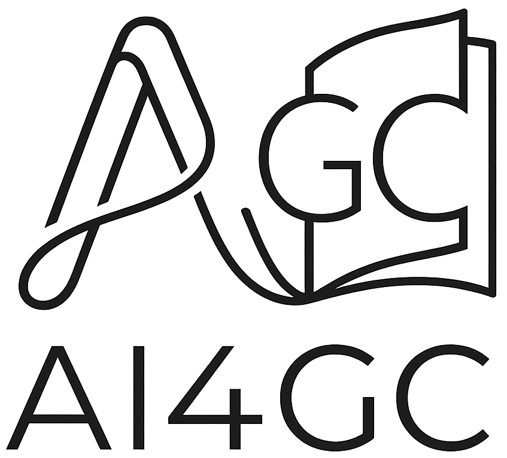
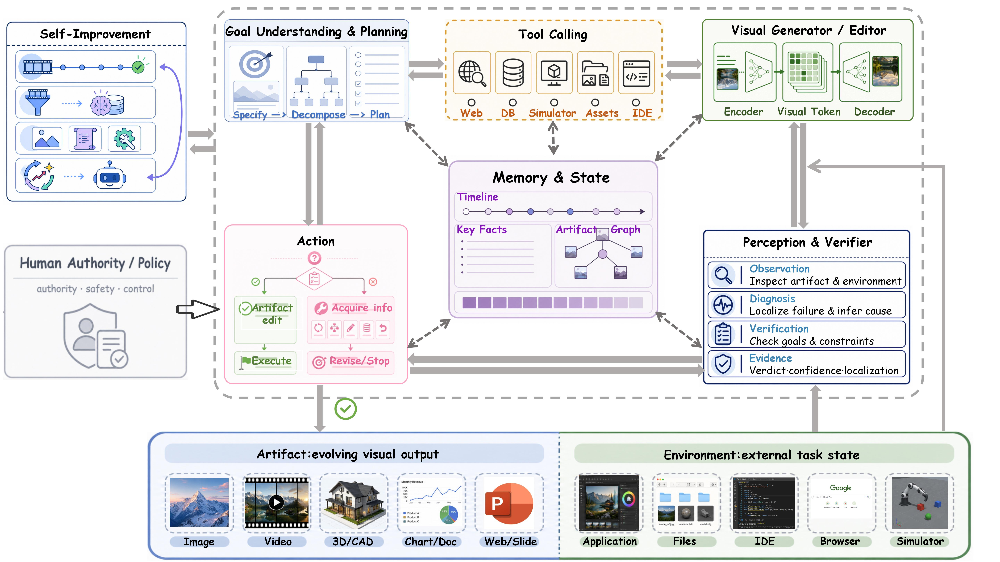
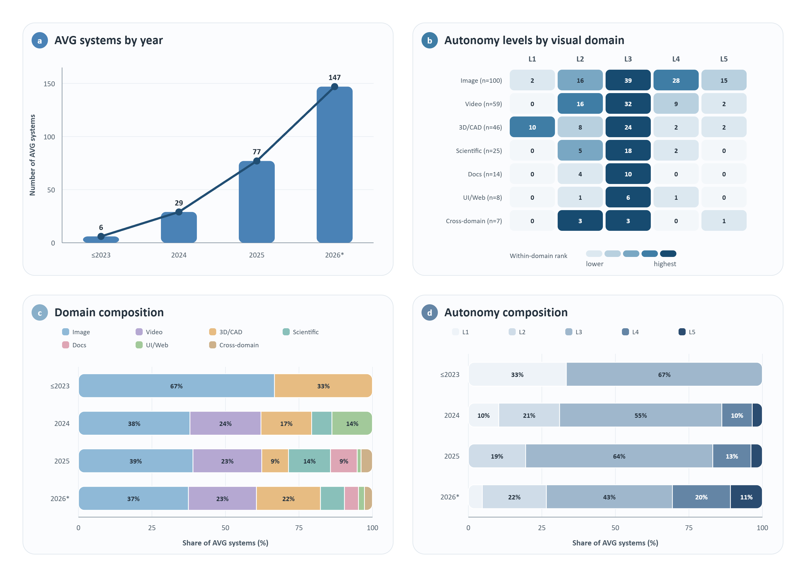

# Agentic Visual Generation
## A Survey

<strong>从单次渲染走向依赖运行时观察的视觉创作</strong>

  <a href="https://www.zju.edu.cn/english/">浙江大学</a> ·
  <a href="https://ai4gc.org/">AI4GC Lab</a>

  <strong>Zihan Xing</strong>1,*+ ·
  <strong>Jin Wang</strong>1,* ·
  <strong>Rong Xia</strong>1,* ·
  <strong>Keming Ye</strong>1 ·
  <strong>Long Chen</strong>2 ·
  <strong>Zheqi Lv</strong>3 ·
  <strong>Zhan Qu</strong>1 ·
  <strong>Biao Yi</strong>1 ·
  <strong>Tianqi Liu</strong>1 ·
  <strong>Junhao Chen</strong>1 ·
  <strong>Jie Yang</strong>1 ·
  <strong>Zhibo Zhu</strong>1 ·
  <strong>Zhouzhou Shen</strong>1 ·
  <strong>Honghui Sheng</strong>1 ·
  <strong>Yurun Chen</strong>1 ·
  <strong>Yuqing Zhang</strong>1 ·
  <strong>Shuanghe Zhu</strong>1 ·
  <strong>Wenkai Wang</strong>1 ·
  <strong>Tao Xiong</strong>1 ·
  <strong>Kuncheng Lin</strong>1 ·
  <strong>Qihang Yu</strong>1 ·
  <strong>Kui Chen</strong>1 ·
  <strong>Yufan Xiong</strong>1 ·
  <strong>Zhou Zhao</strong>4 ·
  <strong>Shengyu Zhang</strong>1,#

1 AI4GC Lab，浙江大学 · 2 香港科技大学 · 3 Cornell University · 4 浙江大学人工智能学院

  <a href="PAPERS.md#browse-by-field">浏览论文索引</a>
  &nbsp;&nbsp;·&nbsp;&nbsp;
  <a href="references.bib">BibTeX 文献</a>
  &nbsp;&nbsp;·&nbsp;&nbsp;
  <a href="README.md">English</a>

  
  
  

  <a href="https://ai4gc.org/">实验室主页</a>
  &nbsp;·&nbsp;
  <a href="https://www.zju.edu.cn/english/">学校主页</a>
  &nbsp;·&nbsp;
  <a href="https://github.com/xzhxjc/Agentic-Visual-Generation-A-Survey">项目仓库</a>

  <a href="#一眼了解">项目概览</a>
  &nbsp;·&nbsp;
  <a href="PAPERS.md#browse-by-field">领域索引</a>
  &nbsp;·&nbsp;
  <a href="#研究地图">研究地图</a>
  &nbsp;·&nbsp;
  <a href="#论文结构">章节导航</a>
  &nbsp;·&nbsp;
  <a href="#公开内容">公开内容</a>
  &nbsp;·&nbsp;
  <a href="#持续更新">参与维护</a>

  

<em>以目标、记忆、工具、感知、行动和跨任务自我改进为核心的视觉创作闭环。</em>

> **项目快照 · 2026 年 9 月 2 日**
>
> 一个持续更新的视觉生成综述与公开论文索引，关注能够规划、调用工具、检查中间结果并调整行为的视觉创作系统。

## News

| 日期 | 更新 |
| --- | --- |
| **2026-09-02** | 将 389 条参考文献重组为按领域组织的可折叠索引，并补齐完整元数据与直接链接。 |
| **2026-08-30** | 增加当前综述追踪的 389 条文献记录的完整可浏览索引。 |
| **2026-08-30** | 重新组织项目主页，突出分类体系、论文发现和领域导航。 |
| **持续进行** | 根据一手来源核对文献元数据、发表状态、图表和章节覆盖。 |

  
  

<strong>内容速览</strong>

- [项目概览](#一眼了解)
- [News](#news)
- [论文集合](#论文集合)
- [领域索引](PAPERS.md#browse-by-field)
- [研究地图](#研究地图)
- [本文提供什么](#本文提供什么)
- [论文结构](#论文结构)
- [公开内容](#公开内容)
- [持续更新](#持续更新)

## 论文集合

当前综述追踪 **389 条 BibTeX 文献记录**。主页只按研究领域组织，年份保留在领域表格的 `Date` 列中，并作为每个领域内部的排序依据。

  
  

| 领域 | 对应章节 | 文献数 | 覆盖年份 |
| --- | --- | ---: | --- |
| [Foundations & Agentic Methods](PAPERS.md#foundations-methods) | 1-3, 11-12 | 33 | 2014-2026 |
| [Image Generation & Editing](PAPERS.md#image-generation) | 4 | 127 | 2016-2026 |
| [Video & Animation](PAPERS.md#video-animation) | 5 | 73 | 2018-2026 |
| [3D / CAD / World](PAPERS.md#three-d-cad-world) | 6 | 59 | 2015-2026 |
| [Scientific Visualization](PAPERS.md#scientific-visualization) | 7 | 31 | 2019-2026 |
| [Structured Documents & Diagrams](PAPERS.md#structured-documents) | 8 | 38 | 2014-2026 |
| [UI / Web Creation](PAPERS.md#ui-web) | 9 | 20 | 2001-2026 |
| [Cross-Domain Applications](PAPERS.md#cross-domain-applications) | 10 | 8 | 2025-2026 |

> 每个领域都可以完整展开或收起。展开后会显示论文名称、完整作者、年份/月份、会议或期刊、卷期页码、论文/DOI/项目链接，以及对应的 BibTeX key。

详细索引：[`PAPERS.md`](PAPERS.md) · 机器可读元数据：[`references.bib`](references.bib)

## 一眼了解

当运行时证据会改变后续视觉创作动作时，视觉生成过程具有 **agentic** 特征。证据可以来自不断演化的视觉产物、执行环境、验证器或交互历史；动作可以是修改提示词、选择工具、修复局部区域、重新规划流程或停止执行。

本文建立统一框架，覆盖以下视觉创作对象：

<table>
  <tr>
    <td align="center"><strong>图像</strong> 生成 · 编辑 · 修复</td>
    <td align="center"><strong>视频</strong> 叙事 · 动画 · 编辑</td>
    <td align="center"><strong>3D</strong> CAD · 资产 · 世界</td>
  </tr>
  <tr>
    <td align="center"><strong>可视化</strong> 图表 · 科学图形</td>
    <td align="center"><strong>结构化文档</strong> 幻灯片 · 布局 · 报告</td>
    <td align="center"><strong>交互界面</strong> UI · Web · 交互系统</td>
  </tr>
</table>

## 研究地图

  

本文从三个层次组织研究：

| 层次 | 核心问题 | 对应章节 |
| --- | --- | --- |
| **运行闭环** | 视觉 Agent 如何决定和执行？ | 第 1–3 章 |
| **创作领域** | 它可以创作哪些视觉产物？ | 第 4–10 章 |
| **学习与证据** | 它如何改进，又应如何评估？ | 第 11–12 章与前沿章节 |

  

<em>自主性从固定生成逐步扩展到反馈适应、长时程控制和持续自我改进。</em>

<strong>框架一览</strong>

| 层次 | 范围 |
| --- | --- |
| **行为** | 基于观察调整动作，可以修订、分支、验证或终止视觉创作过程 |
| **自主性** | L1 固定执行 → L2 反馈适应 → L3 工具与流程控制 → L4 长时程运行 → L5 跨任务改进 |
| **组件** | 目标与规划 · 记忆 · 工具 · 感知 · 行动 · 跨任务自我改进 |
| **领域** | 图像 · 视频与动画 · 3D/CAD/世界 · 科学可视化 · 结构化文档 · UI/Web |

## 本文提供什么

- **行为定义：** 用观察–行动依赖关系识别 agentic 行为。
- **五级自主性：** 用 L1–L5 区分固定执行到持续适应的不同程度。
- **六组件框架：** 目标与规划、记忆、工具、感知、行动、跨任务自我改进。
- **跨领域比较：** 统一比较图像、视频、3D、可视化、文档和 UI/Web 系统。
- **评估视角：** 覆盖产物质量、目标与约束满足、轨迹与决策质量，以及系统和以人为中心的结果。

## 论文结构

| 章节 | 内容 |
| --- | --- |
| 01–03 | 范围、基础与运行闭环 |
| 04–10 | 图像、视频、3D、可视化、文档、UI/Web 与跨领域系统 |
| 11–12 | 训练、适应、评测与可靠性 |
| 前沿章节 | 开放问题与新兴研究方向 |

## 公开内容

| 文件 | 用途 |
| --- | --- |
| [`PAPERS.md`](PAPERS.md) | 按领域组织、包含完整元数据和直接链接的论文索引 |
| [`references.bib`](references.bib) | 当前追踪文献的机器可读 BibTeX 数据 |
| [`assets/`](assets/) | 项目主页实际使用的图片 |

## 持续更新

本文将作为持续维护的研究项目，更新内容包括：

- 核实新的论文和项目；
- 调整领域覆盖范围和分类体系；
- 更新图表和形式化定义；
- 修正 BibTeX 与正式发表信息；
- 更新公开项目索引。

建议使用一手来源提交更新，并在 issue 或 pull request 中记录涉及章节、来源链接和修改内容。

### 更新检查清单

| 提交更新前 | 检查内容 |
| --- | --- |
| 新论文或项目 | 添加一手来源和稳定的 BibTeX 条目 |
| 新图或新表 | 核对图注、来源署名和公开链接 |
| 正文修改 | 保持框架术语与章节范围一致 |
| 版本发布 | 更新 `PAPERS.md`、检查链接，并移除生成产物 |

## 引用

作者、投稿信息和公开版本确定后，将补充正式引用记录。

## 许可证

项目内容采用 [MIT License](LICENSE)。使用论文中的具体图片时，请同时核对对应文献的署名和再使用条件。
